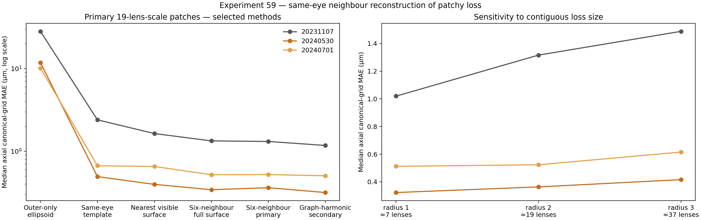

# Reconstructing missing internal surfaces in fossil compound eyes

This project asks a simple question with a difficult limit: if the outer
surface of a fossil eye lens survives but its internal surface is missing, can
the lost surface be reconstructed?

## Positive modern-eye result — 5 September 2026

**A model trained on one modern eye predicts hidden central inner-surface
patches in another eye more accurately than a frozen training template.**
Using Maike Kittelmann's supplied binary corneal-lens masks, the model was
trained on `M3_M_26_01` and frozen before scoring `M3_M_32_01`, both
*D. simulans* M3. Test-eye predictions use retained outer geometry; the test
eye's inner surfaces were not used for fitting, feature normalization or tuning.

| Method on the second eye | Median patch MAE, µm | 90th percentile patch MAE, µm |
|---|---:|---:|
| Specified outer ellipsoid continuation | 7.124 | 10.344 |
| Frozen training template | 1.497 | 1.838 |
| Frozen outer-geometry ridge model | **0.803** | **1.070** |

These are medians and 90th percentiles of per-patch mean absolute **axial**
errors against the supplied binary-mask boundaries. The geometry model's
median error is **46.4% lower** than the template's. Of 71 candidates selected
from outer geometry, 60 met the fixed target-support criteria and were scored;
the other 11 remain recorded in the candidate denominator.

This is a **positive preliminary transfer result**, supporting a learned
relationship between outer geometry and inner shape in these two modern eyes.
It uses intact training examples as a population prior. It does not establish
a unique inner surface from outer curvature alone.

The scope remains one training eye and one test eye, with central crops:
60 patches are not 60 independent animals. Complete rims, closed lens solids,
independent greyscale-image validation, broader biological transfer and fossil
recovery remain unvalidated. The within-eye development test was essentially
tied by a strong position-only smoother; that negative control still stands.
The fossil and other transfer limitations recorded below also remain.

**Calibration is now resolved:** the supplied native masks have
**0.325 µm isotropic spacing**, while the authors' Fig. 3 stacks are binned
4 × 4 × 4 and use 1.3 µm spacing. The authors' code and sampled pixel comparisons
across all twelve specimens establish this source linkage. The micrometre
values above convert the existing voxel scores; no model was retrained for
this conversion.

See the [pilot and frozen transfer protocol](experiments/maike-binary-pilot/README.md),
[calibration evidence](experiments/maike-binary-pilot/fig3_calibration_evidence.json),
[converted results](experiments/maike-binary-pilot/transfer-results/transfer_summary_um.csv)
and [two orthogonal prediction profiles](experiments/maike-binary-pilot/transfer-results/transfer_two_profiles.png).

### Relationship to published work

The source data and established approaches must be distinguished from this
repository's missing-surface prediction experiment:

| Published work | Relevant contribution |
|---|---|
| [Buffry et al. (2024), BMC Biology](https://link.springer.com/article/10.1186/s12915-024-01864-7) | Published the M3/RED3 eye study, lens morphology measurements and associated data/code. The present pilot is a reanalysis of supplied masks associated with that study. |
| [Currea et al. (2023), Communications Biology](https://www.nature.com/articles/s42003-023-04575-x) | ODA/ODA-3D detects ommatidia and estimates anatomical optical parameters from microscope and microCT images. |
| [Zhao et al. (2025), Nature](https://www.nature.com/articles/s41586-025-09276-5) | Uses measured lens and photoreceptor geometry to map viewing directions and relate eye structure to motion-sensitive neurons. |
| [Gál, Horváth and Clarkson (2000), Historical Biology](https://doi.org/10.1080/10292380009380568) | Reconstructed lens shape and optics in the trilobite *Neocobboldia chinlinica*: lens reconstruction itself has longstanding precedent. |

A focused literature check on 5 September 2026 did **not find a published
report of this exact test**: learn inner-patch shape from intact examples in
one eye, predict another eye's hidden inner patches from outer geometry, and
score against its withheld mask surfaces with frozen template and ellipsoid
comparators. Searches covered compound-eye inner-surface prediction, shape
completion and trilobite lens reconstruction, alongside the related sources
above. This is a provisional distinction, not an exhaustive novelty review or
a claim to be the first. The candidate contribution is the explicit prediction
benchmark and its validation; additional independent eyes are needed to assess
how consistently the result transfers.

This update supplements the earlier evidence below, which is retained in full.
Earlier statements that Maike's masks were uninspected, only eleven archives
were available, or voxel spacing was unresolved are historical: all twelve
archives are now available and calibration has been established.

## Answer so far

**Not from outer curvature alone.** In the *Asaphus* scan studied here, local
outer-surface curvature did not predict a wholly missing internal boundary
better than simple geometric baselines.

**A useful approximation is possible when neighbouring facets retain the same
internal boundary.** The most practical method estimates the missing facet's
depth from its six nearest preserved neighbours and combines that estimate with
a shared within-facet shape. In the strict test, complete contiguous regions
were hidden from fitting, tuning and uncertainty calibration.

| Reconstruction of a wholly hidden surface | Median facet error |
|---|---:|
| Position-only smoother | 8.01 µm |
| Six-neighbour depth prior + shared shape | 8.10 µm |
| Axisymmetric ellipsoid | 12.88 µm |
| General quadratic surface | 12.94 µm |
| Strictly local outer curvature | 13.09 µm |

The position smoother and the six-neighbour method have similar median error,
but the six-neighbour method has the lower 90th-percentile error (12.00 versus
17.73 µm) and directly represents the usable biological assumption: nearby
homologous facets can supply missing depth information. Its calibrated 90%
error half-width is still broad at 20.31 µm. In a less independent,
leave-one-facet-out scenario, it reaches 6.59 µm median error. The same
mechanism has now been checked against verified modern proximal surfaces in
all three Arthur Zhao volumes: quadratic-smoothed central proximal targets in
contiguous 19-lens-scale regions are reconstructed at 0.36–1.32 µm median axial
error when same-eye proximal neighbours remain visible.


The result answers the computational part of the original question within one
specimen. It does not yet identify the reconstructed feature anatomically or
show that the method transfers to another fossil.

### Verified modern-lens test

Arthur Zhao's complete *Drosophila* lens meshes now provide verified proximal
surfaces for a stricter test. The method was developed on 20240701, then frozen
and transferred to two untouched volumes using only the retained distal
surface at prediction time.

| Volume and role | Median true depth | Outer-only ellipsoid | Population template | Outer-curvature model |
|---|---:|---:|---:|---:|
| 20240701 development, whole-eye holdout | 13.81 µm | 8.53 µm | 0.89 µm | 0.86 µm |
| 20240530 independent test | 16.35 µm | 11.53 µm | 2.72 µm | 2.49 µm |
| 20231107 independent test | 28.91 µm | 26.99 µm | 15.18 µm | 14.96 µm |

The 20240701 value is a within-volume development result: each whole eye was
held out in turn. The frozen model then transferred well to the similar
20240530 scan but not across the much larger 20231107 depth shift. Outer
curvature adds only 0.084 and 0.221 µm median paired improvement over the
template in the two independent tests. The 2023 mesh is coarse, but
1,528/1,632 lenses pass the corrected QC. The
modern result sharpens the answer: an ellipsoid is insufficient, and a learned
outer-curvature mapping does not remove the need for a matched population
prior, domain-shift checks and uncertainty.


See the [Experiment 58 report](reports/EXPERIMENT_58_ARTHUR_CROSS_VOLUME_VALIDATION.md).

### Verified same-eye neighbour test

Experiment 59 asks a different and narrower question than Experiment 58. It
hides eight separated, contiguous regions in each of both eyes in all three
volumes, then permits surviving proximal surfaces elsewhere in that same eye
to guide the reconstruction. The masks are selected from distal geometry
only after oracle layer separation, and before target availability, quality,
depth or error is examined. Scores compare corresponding axial heights on a
quadratic-smoothed central cap; they do not measure the raw rim, full proximal
mesh or a watertight lens.

| Volume | Fixed six-neighbour primary | Graph-harmonic secondary | Same-eye template | Outer-only ellipsoid |
|---|---:|---:|---:|---:|
| 20231107 | 1.32 µm | **1.18 µm** | 2.40 µm | 28.22 µm |
| 20240530 | 0.36 µm | **0.32 µm** | 0.49 µm | 11.82 µm |
| 20240701 | 0.52 µm | **0.51 µm** | 0.67 µm | 10.16 µm |

The prespecified modern adaptation of the neighbour rule therefore survives
the large 2023 depth shift that defeated cross-volume outer-only transfer. The
new graph-harmonic comparator is
modestly lower in all six eye summaries, but remains method-development
evidence. The validated scope is patchy interior loss:
it requires preserved proximal surfaces in the same eye and does not solve the
case in which only outer curvatures remain everywhere. See the
[Experiment 59 report](reports/EXPERIMENT_59_ARTHUR_NEIGHBOUR_RECONSTRUCTION.md).



## What is being reconstructed

The corrected 3.7 µm *Asaphus* volume contains 116 facet centres that remain
stable across neighbouring surface thresholds. Seventy-four facets pass the
internal-edge quality checks. Their aligned CT data contain a repeated
candidate transition. Profile summaries place its onset/strongest gradient
around 48–52 µm beneath the outer surface; the complete Experiment 54 target
table has a 55.50 µm median depth.

That boundary is facet-associated, but it has not been independently confirmed
as the proximal lens surface. A preservational or mineral-replacement front
could follow the same anatomy. The repository therefore calls it a **candidate
internal CT boundary**, not a recovered lens.

A blinded internal observer pilot provides additional image-domain support.
Nineteen of 23 reviewed QC-accepted facets contained a recognisable transition,
compared with one of five failed-QC controls. Human clicks lay within a median
6.01 µm of the extractor, but were systematically 5.66 µm deeper. The result
supports visual repeatability and exposes a boundary-definition ambiguity; it
does not establish anatomical identity. See the
[Experiment 55 report](reports/EXPERIMENT_55_BLINDED_BOUNDARY_PILOT.md).

Experiment 56 treated that offset as a measurement-definition problem. A
translation estimated without the held-out spatial block reduced median
case-level human–extractor disagreement from 5.66 to 2.30 µm in 14 of 16
cases. It moves the operational median depth from 55.50 to 61.16 µm, but a
common shift applied to both targets and predictions leaves every Experiment
54 reconstruction error unchanged. The remaining p90 disagreement is 8.89 µm,
so definition uncertainty must stay separate from reconstruction error. See
the [Experiment 56 report](reports/EXPERIMENT_56_BOUNDARY_DEFINITION_SENSITIVITY.md).

The 74 facets are repeated observations within one fossil, not 74 independent
specimens.

## Why the conclusion changed

The early fossil model appeared to predict boundary depth with 6.90 µm median
held-out error, compared with 12.76 µm for a radial baseline. A stronger audit
showed that a nonlinear coordinates-only smoother achieved 6.79 µm. The
apparent improvement therefore came mainly from interpolation across the
specimen, not from learning the outer lens geometry.

A frozen transfer to *Archegonus* reinforced that limit. The outer facet
detector transferred, but the internal-boundary stage did not: only one of 76
facets passed the original quality criteria, and the candidate edge was
indistinguishable from inter-facet controls.

Experiment 54 then tested the missing-surface problem directly. It hid complete
candidate surfaces and showed where useful information actually comes from:
neighbouring preserved homologues, not the surviving outer curve by itself.

The detailed evidence and target-leakage controls are in the
[Experiment 54 report](reports/EXPERIMENT_54_WHOLE_FACET_RECONSTRUCTION.md).

## Supporting modern-eye work

Modern scans were used to separate problems that cannot be distinguished in a
fossil:

- Missing facet centres can be interpolated inside an intact lattice, but the
  same method fails at a torn outer edge.
- A within-eye population template helped reconstruct held-out cone intensity
  in one *Apis mellifera* scan, but failed to transfer to an independent
  *Pieris napi* scan.
- Manual *Pieris* traces showed that internal cone direction can differ from
  the surface normal. A locally frozen direction field succeeded in one
  prospective region, but the whole-eye test remained negative.

These results explain why a surface-only visual-field model would be premature.
They do not supply missing soft tissue or validate the identity of the fossil
boundary. The full development trail, including negative results, is kept in
the [experiment history](docs/experiment-history.md).

## Acknowledgements

This project depends on shared data, technical help and scientific discussion.
Specific contributions and data-use conditions are recorded in
[`ACKNOWLEDGEMENTS.md`](ACKNOWLEDGEMENTS.md), so additional contributors can
be credited as the work develops.

Current contributors include Arthur Zhao, who provided the *Drosophila* lens
and photoreceptor-tip surface meshes, and Michael Reiser, who connected the
project with the relevant eyemap resources and researchers. Their
acknowledgement does not imply endorsement of this project's analyses or
conclusions.

## What this project does not claim

The current evidence does not establish:

- that the candidate CT boundary is the proximal lens surface;
- that the reconstruction transfers across fossils, taxa or preservation
  states;
- the undeformed geometry of the living eye;
- true optical axes, field of view, acuity or sensitivity;
- optical behaviour of calcitic lenses, including birefringence;
- missing rhabdoms or other soft-tissue anatomy.

The precise supported and unsupported statements are maintained in
[claim boundaries](docs/claim-boundaries.md).

## Repository guide

| Location | Purpose |
|---|---|
| [`experiments/asaphus/`](experiments/asaphus/) | Surface extraction, stable facet detection and candidate-boundary measurements |
| [`experiments/outer-feature-audit/`](experiments/outer-feature-audit/) | Tests of outer geometry against spatial-only controls |
| [`experiments/repeat-aligned/`](experiments/repeat-aligned/) | Shared-boundary analysis, local gap filling and complete held-out-surface reconstruction |
| [`experiments/blinded-boundary-pilot/`](experiments/blinded-boundary-pilot/) | Frozen observer test of boundary visibility and depth agreement |
| [`experiments/boundary-definition-sensitivity/`](experiments/boundary-definition-sensitivity/) | Spatially held-out calibration of the observer–gradient landmark offset |
| [`experiments/synthetic-centres/`](experiments/synthetic-centres/) | Controlled missing-centre and torn-edge tests |
| [`experiments/outer-only-modern/`](experiments/outer-only-modern/) | Outer-to-inner surface tests on segmented modern lenses |
| [`experiments/arthur-modern-ground-truth/`](experiments/arthur-modern-ground-truth/) | Verified modern distal-only transfer and same-eye patch-loss tests |
| [`experiments/population-prior-modern/`](experiments/population-prior-modern/) | Blind within-eye *Apis* test |
| [`experiments/population-prior-pieris/`](experiments/population-prior-pieris/) | Independent *Pieris* transfer and negative result |
| [`experiments/manual-axis-pieris/`](experiments/manual-axis-pieris/) | Human-traced 3D axis and regional-transfer tests |
| [`apps/cone-centerline-annotator/`](apps/cone-centerline-annotator/) | Clickable tool for collecting 3D cone-axis annotations |
| [`apps/asaphus-boundary-annotator/`](apps/asaphus-boundary-annotator/) | Blinded GUI for tracing the candidate Asaphus CT boundary |
| [`protocols/`](protocols/) | Prespecified boundary-label and independent-fossil validation protocol |
| [`reports/`](reports/) | Complete reports for the decisive audits |
| [`data/README.md`](data/README.md) | Input provenance, filenames, dimensions and hashes |

## Running the code

Python 3.10 or newer is supported.

```bash
python -m venv .venv
source .venv/bin/activate
python -m pip install -r requirements.txt
```

Raw CT volumes are not stored in this repository. Obtain them from their source
repositories, follow the applicable licences, and verify them against the
metadata in [`data/README.md`](data/README.md). Each experiment directory has
its own inputs and run command.

For the main fossil workflow, begin with
[`experiments/asaphus/README.md`](experiments/asaphus/README.md), then continue
with the outer-feature audit and Experiment 54. The committed
[`experiment_54_six_neighbor_surfaces.npz`](experiments/repeat-aligned/results/experiment_54_six_neighbor_surfaces.npz)
contains complete fixed-grid predictions for the 74 held-out facets.

These predictions are internal-boundary surface grids, not watertight
two-surface lens solids. The repository does not currently perform refractive
ray tracing. A mesh exporter and an anisotropic optical model would be useful
downstream tools, but they cannot determine anatomical identity, lens thickness
or focal position from the outer surface alone.

## Current status

The missing-surface benchmark is answered for the analysed *Asaphus* specimen
and now checked against verified modern *Drosophila* surfaces: a wholly missing
surface can be approximated from nearby preserved homologues, but not reliably
from outer curvature alone. The broader problem of reconstructing a closed
anatomical lens when all internal surfaces are absent—and then inferring its
optical function—is not solved.

The next decisive work is biological rather than cosmetic: independently label
the relevant internal anatomy and repeat the frozen test in another fossil with
comparable preserved boundaries. Any claim about the living visual field would
also require specimen-specific deformation constraints and an appropriate
optical model.

The blinded annotation tool and the frozen transfer plan are now specified in
the [boundary annotation and independent-validation protocol](protocols/BOUNDARY_ANNOTATION_AND_INDEPENDENT_VALIDATION.md).

This is an exploratory research repository by Li Yi (Yili Borjigen), not a
finished anatomical reconstruction package. Dataset and software provenance is
listed in [`NOTICE.md`](NOTICE.md). Code in this repository is released under
the MIT licence.


## Source qualification added 5 September 2026

A [direct audit of the supplied Arthur Zhao meshes](experiments/mesh-integrity-audit/README.md)
found continuous lens-layer shells and confirmed that the 2023 depth difference
is present in the supplied geometry. The source paper describes lens-containing
segmentation volumes for landmark detection; it does not independently validate
each exported shell wall as an individual lens boundary. Pending an image-based
or author-confirmed boundary check, the modern targets above should therefore be
read as **surfaces derived from supplied lens-layer segmentations, with anatomical
identity unverified**. The previous numerical results and experiment files are
preserved. One of Maike Kittelmann's supplied corneal-lens binary stacks is the
next candidate reference; its contents have not yet been inspected in this audit.


## Maike binary-lens pilot added 5 September 2026

Eleven supplied M3/RED3 archives have now been inspected. A model trained on a
crop of `M3_M_26_01` predicts central inner-surface patches in `M3_M_32_01`
without using the second file's inner surfaces for fitting. On 60 scorable
patches out of 71 outer-defined candidates, median patch MAE is **2.47 voxels**,
versus **4.61** for a frozen training template and **21.92** for the specified
outer ellipsoid continuation. The within-eye development result was tied by a
strong position-only comparator; that negative control is retained.

This is a first cross-file result against supplied binary corneal-lens masks.
It covers central patches, not complete lens rims or closed solids. Physical
voxel spacing, independent raw-image validation, broader transfer and fossil
recovery remain unresolved. See the [pilot, frozen model and results](experiments/maike-binary-pilot/README.md).
