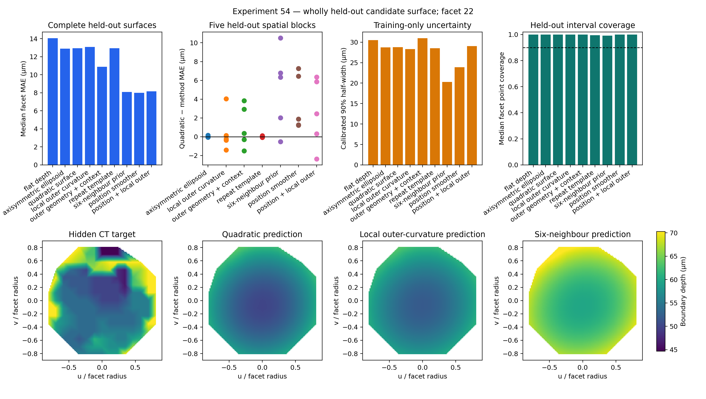

# Reconstructing missing internal surfaces in fossil compound eyes

This project asks a simple question with a difficult limit: if the outer
surface of a fossil eye lens survives but its internal surface is missing, can
the lost surface be reconstructed?

## Answer so far

**Not from outer curvature alone.** In the *Asaphus* scan studied here, local
outer-surface curvature did not predict a wholly missing internal boundary
better than simple geometric baselines.

**A useful approximation is possible when neighbouring facets retain the same
internal boundary.** The most practical method estimates the missing facet's
depth from its six nearest preserved neighbours and combines that estimate with
a shared within-facet shape. In the strict test, complete contiguous regions
were hidden from fitting, tuning and uncertainty calibration.

| Reconstruction of a wholly hidden surface | Median facet error |
|---|---:|
| Position-only smoother | 8.01 µm |
| Six-neighbour depth prior + shared shape | 8.10 µm |
| Axisymmetric ellipsoid | 12.88 µm |
| General quadratic surface | 12.94 µm |
| Strictly local outer curvature | 13.09 µm |

The position smoother and the six-neighbour method have similar median error,
but the six-neighbour method has the lower 90th-percentile error (12.00 versus
17.73 µm) and directly represents the usable biological assumption: nearby
homologous facets can supply missing depth information. Its calibrated 90%
error half-width is still broad at 20.31 µm. In a less independent,
leave-one-facet-out scenario, it reaches 6.59 µm median error.



The result answers the computational part of the original question within one
specimen. It does not yet identify the reconstructed feature anatomically or
show that the method transfers to another fossil.

## What is being reconstructed

The corrected 3.7 µm *Asaphus* volume contains 116 facet centres that remain
stable across neighbouring surface thresholds. Seventy-four facets pass the
internal-edge quality checks. Their aligned CT data contain a repeated
candidate transition. Profile summaries place its onset/strongest gradient
around 48–52 µm beneath the outer surface; the complete Experiment 54 target
table has a 55.50 µm median depth.

That boundary is facet-associated, but it has not been independently confirmed
as the proximal lens surface. A preservational or mineral-replacement front
could follow the same anatomy. The repository therefore calls it a **candidate
internal CT boundary**, not a recovered lens.

A blinded internal observer pilot provides additional image-domain support.
Nineteen of 23 reviewed QC-accepted facets contained a recognisable transition,
compared with one of five failed-QC controls. Human clicks lay within a median
6.01 µm of the extractor, but were systematically 5.66 µm deeper. The result
supports visual repeatability and exposes a boundary-definition ambiguity; it
does not establish anatomical identity. See the
[Experiment 55 report](reports/EXPERIMENT_55_BLINDED_BOUNDARY_PILOT.md).

Experiment 56 treated that offset as a measurement-definition problem. A
translation estimated without the held-out spatial block reduced median
case-level human–extractor disagreement from 5.66 to 2.30 µm in 14 of 16
cases. It moves the operational median depth from 55.50 to 61.16 µm, but a
common shift applied to both targets and predictions leaves every Experiment
54 reconstruction error unchanged. The remaining p90 disagreement is 8.89 µm,
so definition uncertainty must stay separate from reconstruction error. See
the [Experiment 56 report](reports/EXPERIMENT_56_BOUNDARY_DEFINITION_SENSITIVITY.md).

The 74 facets are repeated observations within one fossil, not 74 independent
specimens.

## Why the conclusion changed

The early fossil model appeared to predict boundary depth with 6.90 µm median
held-out error, compared with 12.76 µm for a radial baseline. A stronger audit
showed that a nonlinear coordinates-only smoother achieved 6.79 µm. The
apparent improvement therefore came mainly from interpolation across the
specimen, not from learning the outer lens geometry.

A frozen transfer to *Archegonus* reinforced that limit. The outer facet
detector transferred, but the internal-boundary stage did not: only one of 76
facets passed the original quality criteria, and the candidate edge was
indistinguishable from inter-facet controls.

Experiment 54 then tested the missing-surface problem directly. It hid complete
candidate surfaces and showed where useful information actually comes from:
neighbouring preserved homologues, not the surviving outer curve by itself.

The detailed evidence and target-leakage controls are in the
[Experiment 54 report](reports/EXPERIMENT_54_WHOLE_FACET_RECONSTRUCTION.md).

## Supporting modern-eye work

Modern scans were used to separate problems that cannot be distinguished in a
fossil:

- Missing facet centres can be interpolated inside an intact lattice, but the
  same method fails at a torn outer edge.
- A within-eye population template helped reconstruct held-out cone intensity
  in one *Apis mellifera* scan, but failed to transfer to an independent
  *Pieris napi* scan.
- Manual *Pieris* traces showed that internal cone direction can differ from
  the surface normal. A locally frozen direction field succeeded in one
  prospective region, but the whole-eye test remained negative.

These results explain why a surface-only visual-field model would be premature.
They do not supply missing soft tissue or validate the identity of the fossil
boundary. The full development trail, including negative results, is kept in
the [experiment history](docs/experiment-history.md).

## Acknowledgements and contributed data

Arthur Zhao kindly provided the surface meshes for all three *Drosophila*
µCT volumes used by Zhao et al., covering the corneal-lens and photoreceptor-tip
segmentations. These directly shared meshes are used for registration and
method validation but are not redistributed here pending explicit confirmation
of their redistribution terms. The corresponding processed lens–tip positions
and analysis code are available from the
[Reiser Lab eyemap repository](https://github.com/reiserlab/eyemap_T4), and the
raw imaging data are archived in the
[Janelia dataset](https://doi.org/10.25378/janelia.29111339.v1).

## What this project does not claim

The current evidence does not establish:

- that the candidate CT boundary is the proximal lens surface;
- that the reconstruction transfers across fossils, taxa or preservation
  states;
- the undeformed geometry of the living eye;
- true optical axes, field of view, acuity or sensitivity;
- optical behaviour of calcitic lenses, including birefringence;
- missing rhabdoms or other soft-tissue anatomy.

The precise supported and unsupported statements are maintained in
[claim boundaries](docs/claim-boundaries.md).

## Repository guide

| Location | Purpose |
|---|---|
| [`experiments/asaphus/`](experiments/asaphus/) | Surface extraction, stable facet detection and candidate-boundary measurements |
| [`experiments/outer-feature-audit/`](experiments/outer-feature-audit/) | Tests of outer geometry against spatial-only controls |
| [`experiments/repeat-aligned/`](experiments/repeat-aligned/) | Shared-boundary analysis, local gap filling and complete held-out-surface reconstruction |
| [`experiments/blinded-boundary-pilot/`](experiments/blinded-boundary-pilot/) | Frozen observer test of boundary visibility and depth agreement |
| [`experiments/boundary-definition-sensitivity/`](experiments/boundary-definition-sensitivity/) | Spatially held-out calibration of the observer–gradient landmark offset |
| [`experiments/synthetic-centres/`](experiments/synthetic-centres/) | Controlled missing-centre and torn-edge tests |
| [`experiments/outer-only-modern/`](experiments/outer-only-modern/) | Outer-to-inner surface tests on segmented modern lenses |
| [`experiments/population-prior-modern/`](experiments/population-prior-modern/) | Blind within-eye *Apis* test |
| [`experiments/population-prior-pieris/`](experiments/population-prior-pieris/) | Independent *Pieris* transfer and negative result |
| [`experiments/manual-axis-pieris/`](experiments/manual-axis-pieris/) | Human-traced 3D axis and regional-transfer tests |
| [`apps/cone-centerline-annotator/`](apps/cone-centerline-annotator/) | Clickable tool for collecting 3D cone-axis annotations |
| [`apps/asaphus-boundary-annotator/`](apps/asaphus-boundary-annotator/) | Blinded GUI for tracing the candidate Asaphus CT boundary |
| [`protocols/`](protocols/) | Prespecified boundary-label and independent-fossil validation protocol |
| [`reports/`](reports/) | Complete reports for the decisive audits |
| [`data/README.md`](data/README.md) | Input provenance, filenames, dimensions and hashes |

## Running the code

Python 3.10 or newer is supported.

```bash
python -m venv .venv
source .venv/bin/activate
python -m pip install -r requirements.txt
```

Raw CT volumes are not stored in this repository. Obtain them from their source
repositories, follow the applicable licences, and verify them against the
metadata in [`data/README.md`](data/README.md). Each experiment directory has
its own inputs and run command.

For the main fossil workflow, begin with
[`experiments/asaphus/README.md`](experiments/asaphus/README.md), then continue
with the outer-feature audit and Experiment 54. The committed
[`experiment_54_six_neighbor_surfaces.npz`](experiments/repeat-aligned/results/experiment_54_six_neighbor_surfaces.npz)
contains complete fixed-grid predictions for the 74 held-out facets.

These predictions are internal-boundary surface grids, not watertight
two-surface lens solids. The repository does not currently perform refractive
ray tracing. A mesh exporter and an anisotropic optical model would be useful
downstream tools, but they cannot determine anatomical identity, lens thickness
or focal position from the outer surface alone.

## Current status

The missing-surface benchmark is answered for the analysed *Asaphus* specimen:
a wholly missing candidate surface can be approximated from nearby preserved
surfaces, but not reliably from outer curvature alone. The broader problem of
reconstructing a closed anatomical lens and its optical function is not solved.

The next decisive work is biological rather than cosmetic: independently label
the relevant internal anatomy and repeat the frozen test in another fossil with
comparable preserved boundaries. Any claim about the living visual field would
also require specimen-specific deformation constraints and an appropriate
optical model.

The blinded annotation tool and the frozen transfer plan are now specified in
the [boundary annotation and independent-validation protocol](protocols/BOUNDARY_ANNOTATION_AND_INDEPENDENT_VALIDATION.md).

This is an exploratory research repository by Li Yi (Yili Borjigen), not a
finished anatomical reconstruction package. Dataset and software provenance is
listed in [`NOTICE.md`](NOTICE.md). Code in this repository is released under
the MIT licence.
