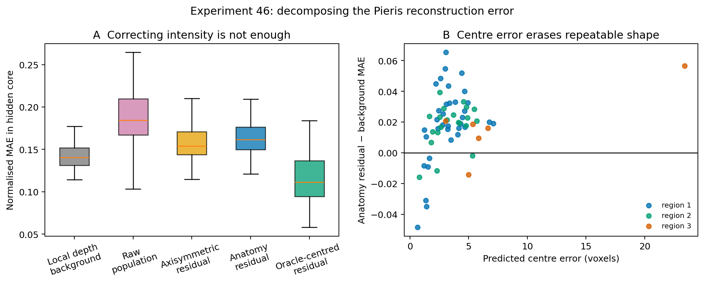
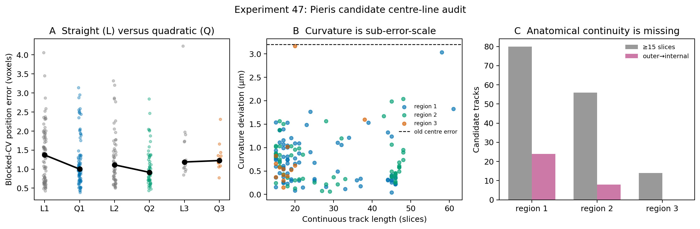

# Fossil compound-eye reconstruction

This project began with a practical question: if a fossil lens keeps its outer
curvature but loses an internal surface, can that hidden surface be recovered?

The short answer is now clearer than it was at the start. **Outer curvature
alone was not enough to determine a wholly missing internal surface in the
data tested here.** A second, narrower route did show promise: when weak traces
of the same internal boundary remain across repeated facets, aligning those
facets can reveal a shared CT signal and help fill a local gap.

That distinction is the main result of this repository.


## How the answer developed

I first tested the easier geometric problem: removing known ommatidial centres
from a modern ODA-3D dataset and asking whether their positions could be found
again. Internal single holes were recovered reliably (97.7% top-1 detection),
and 94.0% of adjacent missing pairs were reconstructed within 10% of local
facet spacing. The same method failed on torn outer edges: only 2.5% of true
torn regions were ranked first. This showed early that interpolation inside a
surviving lattice and extrapolation beyond a broken boundary are different
problems.

I then moved from missing centres to the actual surface question. On segmented
modern lenses, an outer-only regularised model produced a median hidden-surface
error equal to 28.2% of local lens depth. This was useful as a controlled
warning, not as evidence that fossil anatomy had been solved.

In the *Asaphus* CT volume, 116 facet centres were stable across neighbouring
surface thresholds. Seventy-four facets passed the internal-edge quality
checks, with a repeated candidate boundary roughly 52 micrometres beneath the
outer surface. Facet-versus-inter-facet controls support a facet-associated CT
feature, but they do not establish that it is the proximal lens surface; a
diagenetic or mineral-replacement boundary remains possible.

The strongest apparent reconstruction result did not survive a stricter
control. A model using geometry and specimen position had a median held-out
error of 6.90 micrometres, while a nonlinear position-only smoother achieved
6.79 micrometres. Richer outer-surface features also failed to add a stable
signal. On *Archegonus*, the outer-facet detector transferred, but the frozen
internal-boundary stage did not.

The final experiment therefore used repeated internal CT evidence rather than
claiming prediction from the outside alone. Alignment of 116 *Asaphus* facets
gave a shared boundary at 48.03 micrometres, with a broad facet-bootstrap 95%
interval of 43.46–61.75 micrometres. A guarded template method improved local
gap filling over a quadratic fit in a frozen off-centre mask, but it did not
consistently beat a flexible local RBF interpolator. This is a candidate method
for partly preserved boundaries within this specimen, not reconstruction of a
completely invisible lens.

I then tested the population-prior idea where the answer is visible: a modern
*Apis mellifera* micro-CT scan. In a blind spatial-block test of 147 cones, a
population template reduced median normalised error from 0.228 for a
depth-matched background to 0.171, about 25%, and improved median correlation
from -0.096 to 0.624. It beat the background in all 15 held-out blocks and an
axisymmetric template in 13. This was a genuine within-eye result, but it did not transfer. In an independent
*Pieris napi* scan, the global population template had a median normalised error
of 0.204, compared with 0.176 for a depth-matched background. It won in only 4
of 15 spatial blocks. The repeated crystalline-cone lattice is clearly visible
after unfolding; what failed is prediction of a held-out cone by the current
template.

Experiment 46 then separated intensity error from registration error. Removing
the local depth profile and aligning scale and hexagonal orientation did not
rescue the deployable model: its median normalised error was 0.162, versus
0.140 for local background. But a diagnostic supplied with the true internal
centre reached 0.111 and beat background for 49 of 62 targets. This does not
validate reconstruction—the targets are still two-dimensional CT peaks—but it
points to the next problem: tracing and matching each cone's three-dimensional
axis before fitting another intensity template.



Experiment 47 tested whether gently curved axes or unequal z sampling explained
the remaining error. The Pieris acquisition is sampled isotropically at 1.08
micrometres. Candidate intensity ridges showed a small quadratic-path advantage
in two regions, with typical curvature around 0.6 micrometres, but not in the
third. Only 24, 8 and 0 tracks in the three regions remained continuous between
the earlier shallow and internal depths. Curvature is therefore too small to
explain the roughly 3.2 micrometre registration error, and raw intensity maxima
cannot substitute for a validated three-dimensional cone segmentation.



Experiment 48 used seven manually traced cone paths from the first *Pieris*
region. Five overlap through depths 34–50 and move by a median 4.87 voxels
(5.26 micrometres). In a leave-one-cone-out diagnostic, placing the residual
template on a fitted straight axis reduced median normalised error from 0.399
for local background to 0.282 and improved four of five cones. A quadratic
axis also gave 0.282 and beat the straight axis for only one cone. The missing
information is therefore regional axis tilt, not demonstrably cone-specific
curvature.


## What I would tell a palaeontologist

The experiments do not justify drawing an internal lens surface from external
curvature alone. They do justify looking for weak, repeated internal CT signal
across homologous facets before declaring the surface absent. If part of the
boundary survives in the same specimen, a repeat-aligned template may help
complete a local missing region. Anatomical identification and transfer to an
independent fossil are still required.

The numerical limits of that statement are collected in
[claim boundaries](docs/claim-boundaries.md). The less tidy development history,
including failed tests and missing records, is retained in
[experiment history](docs/experiment-history.md).

## Repository contents

- `experiments/synthetic-centres/` contains representative controlled tests of
  missing facet centres, including the torn-edge failure.
- `experiments/outer-only-modern/` contains the controlled outer-to-inner
  surface test on segmented modern lenses.
- `experiments/asaphus/` contains the fossil surface and candidate-boundary
  extraction code.
- `experiments/outer-feature-audit/` asks whether external measurements add
  predictive information beyond spatial smoothness.
- `experiments/repeat-aligned/` tests the shared CT template and deliberate
  local gap filling.
- `experiments/population-prior-modern/` contains the blind within-eye test of
  reconstruction from repeated optical units.
- `experiments/population-prior-pieris/` contains the independent-specimen
  transfer, including its failed strict run and adapted negative result.
- `experiments/anatomy-aware-residual/` decomposes cone intensity and
  registration error after that transfer and records the diagnostic result.
- `experiments/centerline-pieris/` tests candidate 3D paths, curvature and
  cornea-to-internal continuity without calling intensity ridges cone labels.
- `experiments/manual-axis-pieris/` tests human-traced cone axes and separates
  regional tilt from curvature in a within-region diagnostic.
- `apps/cone-centerline-annotator/` is a clickable tool for manually marking
  curved three-dimensional cone axes and exporting reproducible training
  labels. Its preliminary mask is annotation assistance, not validation.
- `experiments/bombus-frozen-transfer/` records the prospective independent
  apposition-eye test before its data are scored.
- `reports/` preserves the decisive audits, including the *Archegonus* and
  *Pieris* transfer failures.
- `figures/` contains selected, publication-size outputs. Large intermediate
  tables and raw CT data are deliberately excluded.

## Running the code

The later fossil experiments use Python 3.11 and the packages in
`requirements.txt`:

```bash
python -m venv .venv
source .venv/bin/activate
python -m pip install -r requirements.txt
```

Each experiment directory has its own short input and run notes. The raw
volumes are not stored in Git. Their provenance, expected filenames and hashes
are recorded in [`data/README.md`](data/README.md).

## Present status

This is an exploratory research record by Li Yi (Yili Borjigen), not a finished
anatomical reconstruction package. The next useful fossil evidence would be an expert or author-provided
segmentation of the relevant lens/cone boundary. The independent *Pieris*
transfer has shown that the present population template is not general.
Experiment 46 identified centre and axis definition as the immediate
bottleneck. Experiment 47 showed that candidate curvature is sub-error-scale.
Experiment 48 now shows directly that the regional cone axis tilts by several
voxels through depth and that a straight tilted axis captures essentially all
of the observed benefit; quadratic curvature adds no stable improvement. The
clickable annotator remains a fallback, while the exact published Pieris labels
and trained dictionaries are being requested from the InSegtCone authors. The
next deployable task is to predict regional tilt without supplying the held-out
manual path, then freeze that rule for the prospective Bombus replication.
Moth superposition eyes will be tested separately.

The modern-eye work builds on the open-source
[ODA project](https://github.com/jpcurrea/ODA) and the public
[InSegtCone dataset](https://doi.org/10.1186/s40850-021-00101-w). Data
provenance and the associated publications are listed in [NOTICE.md](NOTICE.md).
