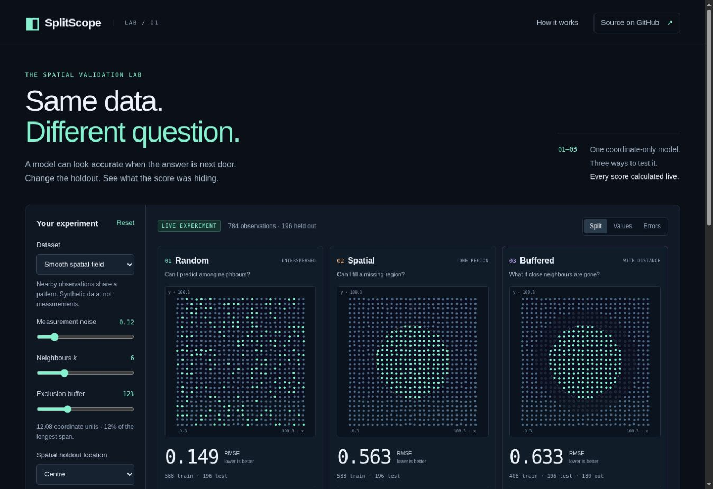

# SplitScope

**Same data. Different question.** A spatial validation lab you can run by opening one HTML file.



Change a train/test split and watch the score, prediction distances and error map change together. SplitScope makes a common modelling pitfall tangible: predicting among nearby observations and predicting into a missing region are different tasks.

**No install · No runtime dependencies · No data uploads · MIT licence**

## Try it

Download [`dist/splitscope.html`](https://github.com/YiliBorjigen/fossil-compound-eye-reconstruction/raw/refs/heads/main/apps/splitscope/dist/splitscope.html) and open it in a modern browser. Everything, including the numerical engine, is embedded in that file. An internet connection is not needed after downloading.

Start with **Smooth spatial field**, switch between **Split**, **Values** and **Errors**, then increase the exclusion buffer. Try **Independent noise** as a negative control. Import a CSV to explore your own spatial observations.

If this is useful in your lab or classroom, a star on [the repository](https://github.com/YiliBorjigen/fossil-compound-eye-reconstruction) helps other researchers find it.

## What it does

- Compares a random holdout, a contiguous spatial holdout and the same spatial holdout with an exclusion buffer.
- Uses distance-weighted kNN on **coordinates only**, alongside a training-mean baseline.
- Shows test RMSE, R², train/test/exclusion counts and mean nearest-training distance.
- Uses shared colour scales for values and errors; point tooltips expose individual predictions.
- Generates repeatable synthetic fields, textured surfaces and independent noise.
- Reads `x,y,value` CSV data entirely within the browser; 20–1,600 unique locations.
- Exports an editable SVG comparison, every assignment/prediction as CSV, and a complete JSON report including data, settings and numerical results.
- Encodes synthetic experiment settings in shareable URL fragments when hosted. Imported data never enters a share link.

### A reproducible example

Default settings: 784 synthetic observations, seed 42, noise 0.12, six neighbours, 25% held out and buffer equal to 12% of the longest coordinate span.

| Holdout | Training | Test | Excluded | kNN RMSE | Mean baseline RMSE | Mean nearest-training distance |
|---|---:|---:|---:|---:|---:|---:|
| Random | 588 | 196 | 0 | 0.149 | 0.561 | 3.47 |
| Spatial | 588 | 196 | 0 | 0.563 | 0.526 | 10.94 |
| Buffered | 408 | 196 | 180 | 0.633 | 0.493 | 21.78 |

These are **synthetic demonstration results**, not measurements or a benchmark of general model performance. The approximately 4.2× buffered/random RMSE ratio changes with the field, seed and settings. It is not an estimate of how much a real study is biased.

## The scientific boundary

A validation gap is **not proof of leakage**, and a harder split is not automatically more appropriate. The right split depends on the prediction task and sampling design. Blocking changes the test locations; buffering also changes training-set size and prediction distance. Random and spatial holdouts have equal test counts but different test observations.

This is **one holdout per strategy**, not cross-validation. It does not estimate uncertainty, select a buffer automatically, tune hyperparameters, validate an arbitrary model, or establish transfer between specimens. The same-eye versus independent-eye distinction matters in the parent fossil-reconstruction project.

Both coordinate axes must use the same linear unit. No independent axis scaling is applied. Use projected coordinates rather than latitude/longitude degrees. Repeated coordinates are rejected: aggregate repeated measurements deliberately or use a tool that supports grouped validation.

## Exact method

1. Generate or import the observations once.
2. Select `round(n × 0.25)` spatial test points nearest the chosen region centre, using Euclidean distance and row index as a deterministic tie breaker.
3. Select the same number of random test points with a seeded Fisher–Yates shuffle.
4. For the buffered split, retain the spatial test points and remove every candidate training point whose distance to **any** test point is less than the buffer. Do not change the buffer when the training set becomes empty.
5. Predict each test value using up to `k` nearest training observations, with inverse-distance weights. The baseline is the mean of the retained training values.
6. Calculate metrics on held-out observations. Empty training sets produce unavailable metrics; constant test values produce undefined R².

No test outcomes enter prediction or split construction. The split geometry uses the complete set of coordinates, which are assumed known at prediction time.

## Run or develop

The built HTML file is enough to use the app. To change it, use Node.js 20 or newer:

```sh
cd apps/splitscope
npm test
npm run build
npm run dev
# Open http://localhost:4173
```

There is no `npm install` step. Tests use Node's built-in test runner. The build combines the four source files into a self-contained HTML file without downloading dependencies.

### Use the engine directly

```js
import { generateData, runExperiment } from './src/engine.mjs';

const data = generateData({ preset: 'field', seed: 42, noise: 0.12 });
const report = runExperiment(data, { k: 6, bufferFraction: 0.12, seed: 42 });
console.table(report.results.map(r => ({
  strategy: r.id,
  training: r.train.length,
  rmse: r.metrics?.rmse,
  meanDistance: r.metrics?.meanDistance,
})));
```

`generateData`, `makeSplits`, `evaluateSplit`, `runExperiment`, `parseCSV`, `dataCSV` and `resultCSV` are exported from `src/engine.mjs`. Data are arrays of numeric `{x, y, value}` objects; split indices are zero-based. CSV row identifiers in exported results are one-based data-row numbers.

## Verification

The numerical tests check deterministic reproduction, disjoint assignments, exact buffer exclusion, train-only prediction, a hand-computable weighted prediction, coordinate-scaling invariance, constant targets, empty training sets, neighbour capping, CSV parsing and complete exports.

Browser checks cover the live default scores, view switching, the independent-noise control, valid/invalid CSV import, preserving data when navigating to the method section, and resetting imported data. Optional WebMCP integration is feature-detected; its browser context was unavailable during validation.

## Related work and provenance

SplitScope is an original implementation of established ideas, with a focus on local execution, visual explanation and exportable evidence. It is not a new spatial validation algorithm. It was motivated by the coordinate-only controls and regional holdouts in the parent [fossil compound-eye reconstruction project](../../README.md). It does not embed collaborator datasets or change the project's research results.

- Roberts et al. (2017), *Cross-validation strategies for data with temporal, spatial, hierarchical, or phylogenetic structure*. [DOI: 10.1111/ecog.02881](https://doi.org/10.1111/ecog.02881).
- Wadoux et al. (2021), *Spatial cross-validation is not the right way to evaluate map accuracy*. [DOI: 10.1016/j.ecolmodel.2021.109692](https://doi.org/10.1016/j.ecolmodel.2021.109692). A contrasting perspective on map accuracy and sampling design.
- [blockCV](https://github.com/rvalavi/blockCV), for spatial cross-validation workflows in R.
- [scikit-learn cross-validation documentation](https://scikit-learn.org/stable/modules/cross_validation.html), for established Python evaluation tools.

Code and interface were developed with AI coding assistance and checked with numerical tests and browser interactions. Li Yi maintains this project. The synthetic field and CSV demonstration require no external data. No source code was copied from the related projects above. The compact seeded random generator uses the widely known Mulberry32 algorithm; it is not a cryptographic generator.

## Contributing

Useful contributions include independent numerical comparisons, accessibility improvements and examples that clarify when a validation strategy matches a prediction task. For a bug, include browser/Node version, synthetic settings or a minimal non-sensitive CSV, and expected versus observed behaviour. Please avoid uploading private research data to issues.

For changes, run `npm test` and `npm run build`, and commit both source and the rebuilt `dist/` files. See [CONTRIBUTING.md](CONTRIBUTING.md).

MIT licensed. See [LICENSE](LICENSE).
