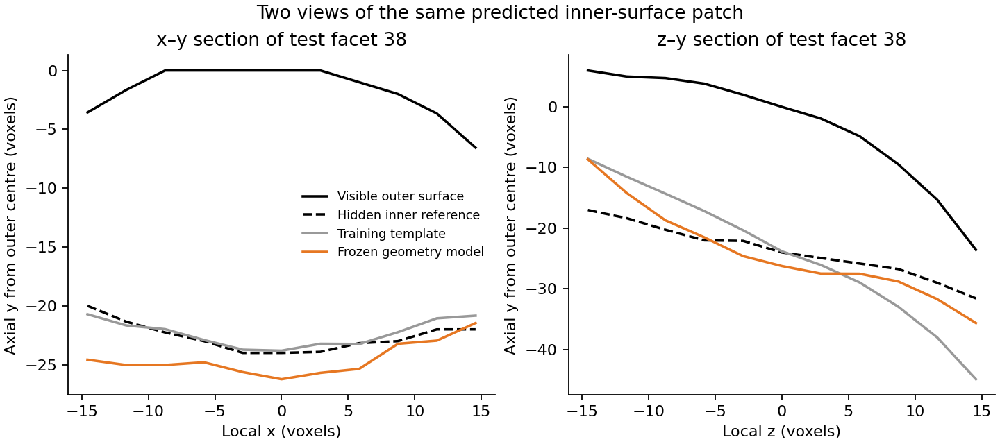

# Inner-surface prediction in modern compound eyes

This analysis tests whether intact lenses can teach a model to predict a
missing inner surface in another eye. It uses binary corneal-lens masks
shared by Maike Kittelmann from the M3 strain of *Drosophila simulans* and
RED3 strain of *D. mauritiana*, associated with
[Buffry et al. (2024)](https://doi.org/10.1186/s12915-024-01864-7).

## Method

The model is trained on central lens patches from `M3_M_26_01`. It learns
inner-surface depth from outer shape and facet size, and is compared with
a shared-shape template and an ellipsoid fitted to the visible surface.
Training uses intact examples; prediction uses only the outer geometry
of the test eye.

The targets are boundaries of the supplied masks. Error is measured along
the image y axis at corresponding surface-grid points. Native voxel spacing
is **0.325 µm in all three directions**, established from the authors' code
and the [calibration checks](fig3_calibration_evidence.json).

## Results

The first separate test eye, `M3_M_32_01`, had 60 scorable patches from
71 candidates. Median patch error was 0.803 µm for the geometry model,
1.497 µm for the template and 7.124 µm for the ellipsoid.

The unchanged model was then applied to the other ten eyes. It had lower
median error than the template in six eyes and higher error in two;
surface detection failed in the remaining two. Within each species,
geometry improved on the template in three of four scorable follow-up eyes.

The eight scorable follow-up eyes contain 231 scorable patches from
314 candidates. Coverage varies considerably: some eyes support only a
small part of the selected region. The within-eye development test was also
matched by a position-only smoother. The evidence supports useful prediction
in several eyes, with inconsistent gains from outer geometry.

The analysis covers central patches. It does not reconstruct complete rims
or closed lenses, and mask boundaries have not been independently checked
against the original greyscale CT. The geometry model produces some
nonpositive thickness values in two follow-up eyes. Its predictions need
further validation before use as anatomical reconstructions.

## Results and reproduction

| File or directory | Contents |
|---|---|
| [First separate-eye test](transfer-results/transfer_summary_um.csv) | M32 errors in voxels and micrometres |
| [Completed follow-up](replacement-transfer-results-20260909/README.md) | Every eye's result, coverage and failures |
| [Combined results](replacement-transfer-results-20260909/combined_eye_summary.csv) | Per-eye medians and 90th-percentile errors |
| [Follow-up protocol](REMAINING_EYES_PROTOCOL.md) | Crop selection and scoring rules fixed before the test |
| [Saved model](transfer-results/frozen_training_model.json) | Training coefficients and template |

Install the local dependencies with
`python -m pip install -r experiments/maike-binary-pilot/requirements.txt`.

The [original pilot](run_pilot.py) trains and evaluates within M26.
[transfer_m32.py](transfer_m32.py) runs the first separate-eye test.
[transfer_remaining.py](transfer_remaining.py) applies the saved model to
the ten follow-up eyes. [complete_replacement_checks.py](complete_replacement_checks.py)
runs only the two checks completed after replacement files arrived.
Each script accepts `--help`; the linked reports contain run commands and
the required source filenames.

Source images are not redistributed. The earlier notes below document
development decisions, calibration and the original sequence of results.

<details>
<summary>Original pilot notes and subsequent updates</summary>

These notes retain the original wording and order. The summary above includes
the completed calibration and follow-up results.

# Maike binary-lens pilot and frozen M3 transfer — 5 September 2026

## Result

A first predictor now reconstructs central inner-surface patches in a second
supplied M3 eye file without training on that file's inner surfaces. On the
60 scorable patches out of 71 outer-defined candidates in `M3_M_32_01`, a model
trained on `M3_M_26_01` has median per-patch mean absolute axial error of
**2.47 voxels**, versus **4.61** for the frozen training template and **21.92**
for the specified outer ellipsoid continuation. This is an exploratory
cross-file result on the supplied binary lens segmentations, not complete lens
or fossil recovery.

| Test method | Median patch MAE, voxels | 90th percentile patch MAE, voxels |
|---|---:|---:|
| Outer ellipsoid continuation | 21.919 | 31.829 |
| Frozen training shape template | 4.607 | 5.655 |
| Frozen outer-geometry ridge | 2.470 | 3.291 |

The geometry model has smaller full-grid MAE than the template for all 60
scorable test patches. Median paired improvement is 2.009 voxels. These are
repeated observations in one test file, not 60 independent specimens. Median
target axial thickness is 21.237 voxels; error remains material.



The example was chosen by proximity to the crop centre before considering
error. The template is better in this example's x–y section, but worse across
the full two-dimensional patch: full-grid MAE is 4.702 versus 2.291 voxels. The
z–y section shows why a single profile must not substitute for a surface score.

## Inputs and memory use

Eleven of the twelve supplied ZIPs were accessible. `M3_F_28_03` failed to attach
and was not inspected. `archive_inventory.json` records every available file's
hash, numbered-slice continuity, all TIFF header dimensions, and byte counts.
The eleven complete 8-bit arrays would occupy **28.477 GB** (decimal). The
selected M26 stack is **694 × 1575 × 1689**, occupying 1.846 GB if fully decoded;
its ZIP is about 6.17 MB. TIFF LZW compression, rather than ZIP expansion alone,
accounts for the large difference.

The pilot retains only a **694 × 300 × 450** native-resolution crop, about
93.7 MB. M32 uses a **714 × 300 × 450** crop, about 96.4 MB. Slices are decoded
one at a time. Only these two archives had their pixel data analysed; other
archives were inspected through headers only and remain available for later
tests. TIFFs contain 8-bit palette indices; every pixel in both analysed source
stacks was checked to have value 0 or 1. No physical voxel spacing was found in
any available TIFF header. All distances and model geometry here are explicitly
in voxel coordinates; physical dimensions and anisotropy remain unresolved.

Maike Kittelmann supplied these data to Li Yi. The M3 and RED3 names match the
strains in [Buffry et al., BMC Biology (2024)](https://doi.org/10.1186/s12915-024-01864-7).
That paper describes manually cleaned binary images containing corneal lenses.
The supplied mask therefore offers a more direct lens-tissue reference than an
unqualified lens-containing shell, but its boundaries have not been checked
against the original greyscale CT in this run. The archives are not redistributed.

## Representation and prediction

The M26 crop contains one large connected foreground component, rather than
separate labels for every lens. Individual facet candidates are located by
bumps in the **outer** boundary height map. Localisation, spacing-based radii
and candidate selection use no inner-boundary measurements. The mask supports
central patches; this pipeline does not resolve complete individual rims.

For the selected downward-facing patch, distal and proximal boundaries are
the last and first occupied y voxels, placed at half-voxel interfaces. A target
column is scorable only when its foreground is continuous and does not touch
the y crop edge. Boundary heights are bilinearly sampled on a canonical disk
of radius 0.7 times the estimated facet radius. Targets are mask-derived heights,
not quadratic-smoothed proximal fits. The score is axial y error at corresponding
points, not nearest-mesh distance, optical error or full-lens volume error.

The ellipsoid baseline fixes its lateral semi-axis from outer facet spacing and
fits the visible branch before continuing its opposite branch. Its failure
applies to this specific continuation rule, not every conceivable ellipsoid fit.
The template learns pointwise median thickness divided by facet radius. The
ridge model learns normalized thickness from retained outer radius, quadratic
shape coefficients and fit residual. It uses a fixed regularization of 10;
feature normalization is fitted only on training data.

## Development and spatial-only check

The first M26 crop contains 64 outer-defined candidates, 62 with full target
support. Four contiguous z bands are withheld in turn, with a 30-voxel training
guard. Median facet errors are 13.493 voxels for the ellipsoid, 1.408 for the
training template and 0.984 for outer geometry.

A necessary post-pilot diagnostic used a position-only thin-plate RBF to predict
thickness, with smoothing chosen within each training split. Its median error
is **0.995 voxels**, essentially tied with geometry; the median paired
position-minus-geometry difference is **−0.004 voxels**. The within-eye result
therefore does not establish an advantage from outer geometry over spatial
interpolation. This negative control is retained in `results/position_baseline*`.

## Frozen transfer and scoring coverage

After development, all 62 scorable M26 patches train one frozen model. Its
parameters are written to `transfer-results/frozen_training_model.json` before
M32 target extraction. The M32 crop was located from a middle-slice preview's
outer envelope, so this is not a fully blinded end-to-end deployment test.
Candidate rules, grid, model features and regularization remain unchanged.
No M32 inner surface is used for training, normalization, calibration or tuning.

The four spatial summaries of the test crop are descriptive groups, not four
separate cross-validation fits. Geometry/template median errors are 2.03/3.98,
2.33/4.56, 2.67/5.10 and 3.07/5.64 voxels. Eleven of 71 outer-defined candidates
lacked complete target support under the fixed column/crop rule; they remain
in the recorded denominator and receive no fabricated error. The headline
accuracy is conditional on the remaining **60/71 (84.5%)**. Predictions were
still generated for every candidate.

Removing all test inner grids and target-validity flags leaves predictions
exactly unchanged for all 71 candidates. Every reported transfer error was
recomputed from its saved prediction grid and matched. No method predicted
nonpositive thickness on the selected grids. These checks verify the stated
computation; they do not validate the original segmentation anatomically.

## What remains unresolved

This is a first two-file, within-strain result on limited central regions.
M3_M_26_01 and M3_M_32_01 are distinct supplied specimen identifiers, but this
run did not independently verify the full sample provenance. Physical x/y/z
spacing, segmentation uncertainty, full rims, closed lens meshes, whole-eye
transfer, other strains, fossils, deformation and optical function remain
outside the evidence. A population prior is still required; no unique solution
from an unconstrained outer surface has been established. No uncertainty band
has been calibrated. Further specimens should be scored only after confirming
the export calibration and freezing a broader outer-only localisation rule.

## Reproduction

```bash
python -m pip install -r experiments/maike-binary-pilot/requirements.txt
python experiments/maike-binary-pilot/inventory_archives.py /path/to/zips \
  --output /path/to/new-inventory.json
python experiments/maike-binary-pilot/run_pilot.py /path/to/M3_M_26_01.zip \
  --output /path/to/new-pilot-results
python experiments/maike-binary-pilot/check_position_baseline.py /path/to/new-pilot-results
python experiments/maike-binary-pilot/transfer_m32.py \
  /path/to/M3_M_26_01.zip /path/to/M3_M_32_01.zip \
  --output /path/to/new-transfer-results
python experiments/maike-binary-pilot/plot_transfer_profiles.py /path/to/new-transfer-results
```

Use the original archive names containing the specimen IDs. Output paths refuse
overwriting. The code, manifests, frozen model, per-facet errors, summaries and
derived figures are committed. Mask-derived full prediction grids are generated
locally by the scripts; input TIFFs and local grids are not redistributed here.

## Replacement archive received — 5 September 2026

The replacement `M3_F_28_03` ZIP is now accessible, completing all twelve
named M3/RED3 archives. Its 875 TIFF slices have unique consecutive numbers
42–916 and dimensions 1914 × 1470 pixels. The ZIP occupies 7,929,219 bytes;
the TIFF files total 8,645,014 bytes after ZIP extraction, while the decoded
8-bit array would occupy 2,461,882,500 bytes (2.462 GB). Across all twelve
archives, decoded 8-bit arrays would total 30.939 GB (decimal).

[The replacement receipt](replacement_M3_F_28_03_inventory.json) records its
SHA-256 and header inspection. It supersedes the earlier attachment-failed
status; the eleven-file `archive_inventory.json` and the original report above
remain preserved as the pilot's historical snapshot. Only ZIP metadata and
TIFF headers were inspected for this replacement. No voxel calibration was
found in those headers. The two-file reconstruction results above are unchanged.

## Calibration resolved from the supplied Fig. 3 archive

The subsequently supplied `fig3_share.zip` resolves the earlier calibration
question for all twelve native M3/RED3 stacks. Use **x = y = z = 0.325 µm**
for the original TIFF masks. The separate Fig. 3 images in `share/stacks.zip`
were reduced into **4 × 4 × 4** bins and use **1.3 µm** spacing in every
direction. The reconstruction pilot used the original masks.

Evidence within the authors' archive:

- `share/README.md` describes the 4 × 4 × 4 binning.
- `share/plot&stats.py`, lines 107–109, defines a base pixel size of 0.325 µm
  and multiplies it by a bin size of 4. Lines 125–126 pass that same value as
  both `pixel_size` and `depth_size`.
- `share/analysis.py` performs the same calculation and uses equal in-plane
  and depth spacing. Its `# mm` comment conflicts with the explicit `# um`
  in the plotting script, its micrometre-labelled outputs, and the published
  325 nm scan scale; it is treated as a unit-comment error.
- `share/rescale_imgs.py` implements the three-dimensional binning. For each
  of twelve matching specimen folders, output slice names and counts match
  four-slice grouping of the supplied original stack. Repeating that
  operation on three full planes per eye (quarter, middle, three-quarter)
  gives **zero differing pixels across 5,863,803 compared pixels**. This
  comparison reproduces the authors' per-slice rounding before summing in z.

[The calibration evidence](fig3_calibration_evidence.json) records archive and
script hashes, native archive hashes, exact slice matches and sampling scope.
This establishes the connection to the authors' stated calibration; it is a
sampled image-identity check, not an independent measurement of scanner scale.
The earlier generic Diamond 2× binning possibility is superseded by this
dataset-specific code and image comparison.

The original voxel scores and fitted model are preserved. Multiplying axial
errors by 0.325 gives the following values for the same 60 scorable M32 central
patches out of 71 candidates:

| Method | Median patch MAE, µm | 90th percentile patch MAE, µm |
|---|---:|---:|
| Outer ellipsoid continuation | 7.124 | 10.344 |
| Frozen training template | 1.497 | 1.838 |
| Frozen outer-geometry ridge | 0.803 | 1.070 |

[Converted results](transfer-results/transfer_summary_um.csv) retain all
original voxel columns and add micrometre columns. This is a unit conversion,
with no retraining or new reconstruction experiment. Full lens rims, fossil
transfer, optical validation and the other stated limitations remain unresolved.
The earlier calibration-unknown statements above are preserved as history.

Reproduce the source linkage without unpacking full image volumes:

```bash
python experiments/maike-binary-pilot/check_fig3_calibration.py \
  /path/to/fig3_share.zip /path/to/native-zips \
  --output /path/to/new-calibration-evidence.json
```

Sources: the user-supplied Fig. 3 archive associated with
[Buffry et al. (2024)](https://doi.org/10.1186/s12915-024-01864-7) and its
[Figshare data/code record](https://figshare.com/articles/dataset/Data_and_code_for_Figures_3_and_4/24769677).
Input archives and third-party scripts are not redistributed here.

## Frozen follow-up on the remaining eyes — 9 September 2026

The original M26 model has now been applied, without retraining, to the other
accessible source eyes under a prespecified outer-only crop rule. Geometry
improves median patch error over the frozen template in four of six additional
scorable eyes and is worse in two. Two further eyes fail deployment, and two
current source ZIP copies are unreadable. These outcomes limit the generality
of the original M32 result; the original files and values are preserved.

See the [full results and source-file status](remaining-eye-results-20260909/README.md)
and [frozen protocol](REMAINING_EYES_PROTOCOL.md). The original 46.4% gain is not
uniformly transferable. The positive results still concern central binary-mask
patches, not complete fossil lenses or optical function.

## Replacement checks completed — 9 September 2026

Both replacement archives match the original calibrated sources and have now
been scored using the unchanged frozen model and transfer rules. M3_F_28_03
has median patch MAE 1.375 µm versus 1.489 µm for the template (15/42 candidates
scorable); RED3_25_M_26 has 1.192 versus 1.719 µm (21/43 scorable).

The completed ten-eye follow-up has six improvements and two losses among
eight scorable eyes, plus two deployment failures. Earlier unreadable-input
entries are superseded and preserved. See the [completed results and combined
summary](replacement-transfer-results-20260909/README.md). Earlier eyes were
not rerun; the model and scoring settings are unchanged.

</details>
