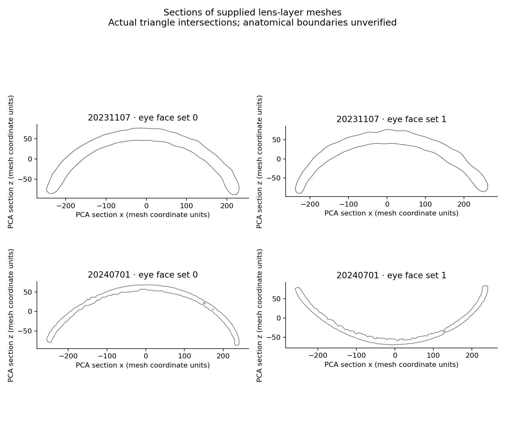

# Source qualification of Arthur Zhao's lens meshes — 5 September 2026

## Finding and consequence

The supplied 20231107 and 20240701 WRLs match the SHA-256 hashes used in
Experiment 58. Each eye is represented predominantly by a continuous closed
shell. No inconsistent shared-coordinate indexing or non-identity transform was
found in these two inputs. The 2023 shell's greater depth is present in the
original triangle geometry; it is not solely created by the downstream
quadratic target fit.

**These observations do not establish that the two shell walls are the actual
distal and proximal boundaries of each individual corneal lens.** Until checked
against source images or a segmentation definition supplied by the authors,
the targets in Experiments 57–59 should be described as *surfaces derived from
supplied lens-layer segmentations*, with anatomical identity unverified.
Their numerical errors remain results against those operational targets.
This qualification also applies to the earlier README wording "verified modern
proximal surfaces" and "complete lens meshes"; the previous files and results
have been preserved.

## What the source paper establishes

Zhao et al. describe segmenting a volume containing the lenses and a separate
volume containing photoreceptor tips. Contrast-based spot detection, visual
inspection and manual editing then establish individual centre landmarks for
viewing-direction measurements. The Methods do not establish per-lens proximal
surface validation for the exported shells. This does not show that the authors'
segmentations are wrong or unsuitable for their original landmark task.

Source: [Zhao et al., Nature (2025), Methods, Ommatidia directions](https://www.nature.com/articles/s41586-025-09276-5).

The repository's existing importer retains vertices but drops triangle
connectivity. It partitions the connected layer around lens landmarks, uses
lens-to-tip directions and a two-group depth split to construct the retained
and hidden surfaces, then fits quadratic caps. That procedure defines a
geometric benchmark; it cannot independently validate anatomical identity.

## Direct checks on the supplied geometry

The audit preserves every supplied triangle and checks connected components,
edge incidence, face winding and exact plane intersections. It uses no
landmark recovery, new segmentation, missing-source download or reconstructed
replacement data.

| File | Eye face set | Vertices | Triangles | Components | Largest component |
|---|---:|---:|---:|---:|---:|
| 20231107 | 0 | 120,704 | 241,404 | 1 | 100% |
| 20231107 | 1 | 131,774 | 263,544 | 1 | 100% |
| 20240701 | 0 | 657,352 | 1,314,652 | 27 | 99.887% |
| 20240701 | 1 | 667,326 | 1,334,508 | 62 | 99.693% |

All four face sets have zero boundary edges, zero edges incident to more than
two faces, and zero inconsistent two-face edge windings. The 2024 sets contain
36 and 10 zero-area triangles at the audit's 1e-12 area threshold. These were
counted, not repaired. Connectivity alone does not exclude self-intersections
or establish anatomy. The components are shell components, not lens counts.



Sections use a deterministic PCA frame for each eye, with the plane passing
through the mesh's vertex mean. They are geometric diagnostic cuts, not matched
anatomical sections or lens optical axes. The WRLs do not declare physical
units, so the figure retains mesh coordinate units; the earlier analysis
interpreted those coordinates as micrometres. The apparent inversion in one
panel comes from the deterministic PCA sign convention.

The sections show that the thicker 2023 shell is already encoded in the
supplied data. The scan-to-scan difference could still reflect segmentation
boundaries, specimen preparation or biology. The files alone do not distinguish
these explanations. Neither the old extraction's correctness nor its failure
has been established at individual lens boundaries.

## Next input: one Maike archive

The M3 and RED3 filenames shown by Li Yi match the strains in Buffry et al.
Their Methods describe thresholding and separating corneal lenses, and manually
cleaning datasets into binary images containing only corneal lenses. This is
a more directly relevant candidate reference for complete lens geometry.
The contents of Maike's twelve archives have **not** yet been inspected here,
so a filename-to-dataset match, complete boundaries and individual label IDs
must not be assumed.

Source: [Buffry et al., BMC Biology (2024), Methods, 3D segmentation and ODA and allometry](https://doi.org/10.1186/s12915-024-01864-7).

Request only the archive beginning `tiffs_M3_M_26_01_eye_lenses` first
(approximately 6.2 MB in the supplied screenshot). Keep it compressed. Read the
ZIP member sizes, then TIFF headers and a few slices before allocating a full
volume. ZIP-expanded size and decoded TIFF array size are distinct quantities;
neither is known from the screenshot. If actual individual lens boundaries are
retained, select a small complete region, verify its boundaries, then hide its
proximal surfaces for the first reconstruction test. Other specimens stay
untouched until that representation and evaluation rule are fixed.

Maike Kittelmann is credited for sharing these candidate data with Li Yi, and
Arthur Zhao for supplying the WRLs audited here. This audit does not establish
data redistribution permission; supplied meshes are not included.

## Reproduce and validation

Requires Python 3.10+, NumPy, SciPy and Matplotlib. From the repository root:

```bash
python experiments/mesh-integrity-audit/audit_meshes.py \
  /path/to/20231107-PTA-surface-lens.wrl \
  /path/to/20240701-PTA-surface-lens.wrl \
  --output /path/to/new-audit-output
```

The script refuses to overwrite its named output files. Its parser supports
the shared-coordinate triangular Imaris format in these supplied files and
rejects multiple coordinate tables, non-triangular faces, invalid indices or
non-identity transforms. It is not a general VRML scene importer.

`results/mesh_audit.json` records hashes and full topology statistics. The script
also writes the exact section segments as CSV for local figure reproduction;
the supplied full meshes and section-coordinate CSV are not redistributed.

Analytical tetrahedron checks passed for closed topology, detection of a flipped
face's three inconsistent edges, and the exact four-segment central plane
intersection. All four supplied eye face sets completed the audit. No anatomical
reconstruction accuracy was measured in this audit.
