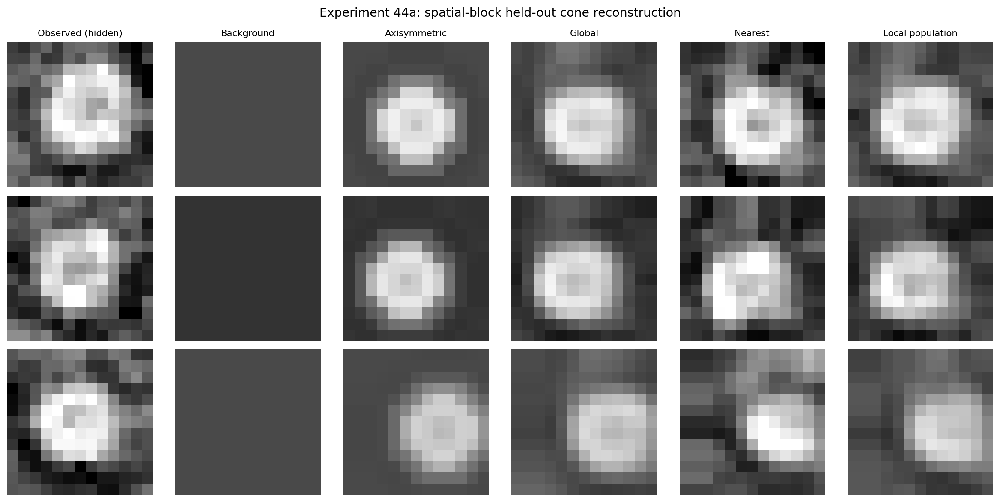

# Population-prior reconstruction in a modern compound eye

This experiment asks a narrower question than the fossil analysis: if the
outer facet lattice survives, can other cones in the same eye provide a useful
prior for the missing internal CT signal beneath one facet?

The test uses one *Apis mellifera* micro-CT scan and its published InSegtCone
input labels. The labels identify the external cornea and full eye volume;
they do not segment individual cones. Individual outer and inner centres are
therefore detected from the original CT intensity. The inner centre and target
voxels of every held-out cone are hidden during reconstruction.

## Result

Three non-overlapping patches yielded 147 matched cones. Each patch was split
into five contiguous spatial blocks, giving 15 held-out folds. For each fold,
the surface-to-cone mapping and population templates were fitted using only
the other four blocks.

| Method | Median normalised MAE | Median correlation |
|---|---:|---:|
| Depth-matched background | 0.228 | -0.096 |
| Axisymmetric population template | 0.195 | 0.443 |
| Global population template | **0.171** | **0.624** |
| Nearest training cone | 0.201 | 0.546 |
| Local six-cone population | 0.173 | 0.628 |

The global population template reduced median error by about 25% relative to
the background control. It beat the background in all 15 folds and the
axisymmetric control in 13 of 15 folds. The latter comparison matters because
it shows that the gain is not explained only by inserting a generic round
object at the expected depth.




This is a positive controlled result, but it is still one modern specimen.
The 147 cones are repeated anatomical observations, not independent animals.
It does not show that a wholly invisible fossil inner surface can be inferred
from outer curvature. It supports a more modest route: preserved outer facets
can locate a missing unit, while homologous units in the same eye provide a
population prior for its internal CT appearance.

## Data

- raw scan: MorphoSource media `000396182`, specimen
  `Apis mellifera LU:3_14:AM_F_5`
- published label: `60185_AM_F_manLabel.nii`
- acquisition voxel size reported by Tichit et al. (2022): 1.6 micrometres
- label values used: 7, external corneal surface; 3, full eye volume

Raw TIFFs, NIfTI labels and generated NumPy volumes are deliberately excluded
from Git. See [`../../data/README.md`](../../data/README.md) for provenance.

## Reproduction

Prepare the TIFF stack:

```bash
python prepare_dataset.py \
  --data-dir /path/to/Apis_data \
  --output /path/to/work/60185_AM_F.npy
```

Unfold the three frozen patches:

```bash
python unfold_local_patch.py --volume /path/to/work/60185_AM_F.npy \
  --label /path/to/Apis_data/60185_AM_F_manLabel.nii \
  --output-dir /path/to/work/patch_1 --seed 800 700 225

python unfold_local_patch.py --volume /path/to/work/60185_AM_F.npy \
  --label /path/to/Apis_data/60185_AM_F_manLabel.nii \
  --output-dir /path/to/work/patch_2 --seed 1100 620 150

python unfold_local_patch.py --volume /path/to/work/60185_AM_F.npy \
  --label /path/to/Apis_data/60185_AM_F_manLabel.nii \
  --output-dir /path/to/work/patch_3 --seed 450 680 275
```

Run the blocked tests:

```bash
python run_blind_pilot.py --patch-dir /path/to/work/patch_1 \
  --output-dir results/patch_1
python run_blind_pilot.py --patch-dir /path/to/work/patch_2 \
  --output-dir results/patch_2
python run_blind_pilot.py --patch-dir /path/to/work/patch_3 \
  --output-dir results/patch_3
```

The committed JSON and CSV files contain the reported summaries. Experiment 45
performed the independent *Pieris napi* transfer. The current method did not
replicate: the population template was worse than a depth-matched background.
