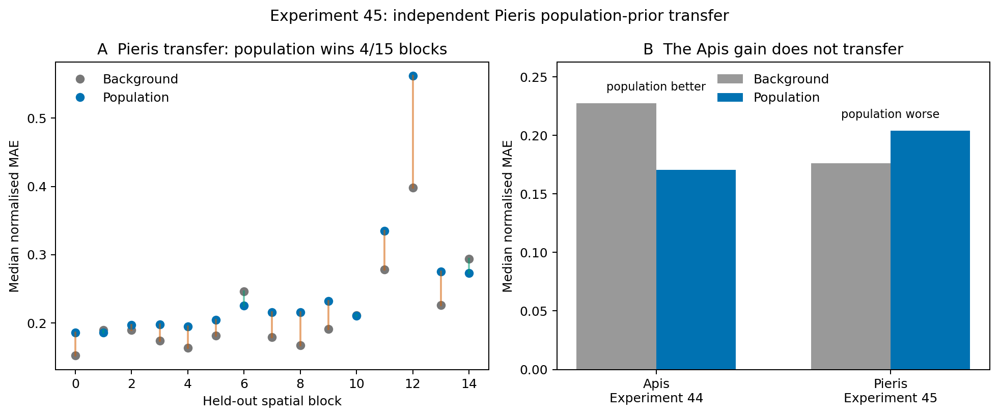
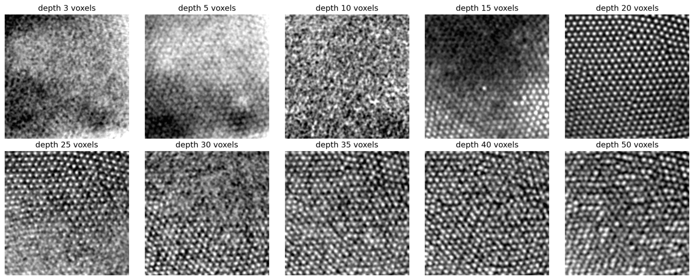

# Independent Pieris transfer

Experiment 45 tests whether the positive within-eye result from *Apis
mellifera* transfers to an independent animal and species, *Pieris napi*.

The answer is no under the current method.

The strict Experiment 44 code stopped before reconstruction because its
absolute surface-intensity rule found no outer centres in the 16-bit Pieris
scan. A specimen adapter was therefore fixed before held-out scoring. It used
global percentile normalisation, registered the published cornea/eye-volume
label, selected three regions from surface geometry alone, and chose shallow
and internal lattice depths using nearest-neighbour regularity. The
reconstruction, spatial blocks, target masking and five controls were otherwise
unchanged.

Across 62 matched optical units and 15 spatial blocks:

| Method | Median normalised MAE | Median correlation |
|---|---:|---:|
| Depth-matched background | **0.176** | **0.670** |
| Axisymmetric population | 0.179 | 0.586 |
| Global population | 0.204 | 0.509 |
| Nearest cone | 0.218 | 0.512 |
| Local population | 0.198 | 0.529 |

The global population template beat background in only 4 of 15 blocks and 15
of 62 cones. Its median cone-level error was 17.9% worse. Training-only choice
between translation and affine centre maps, and a post-hoc smaller central
evaluation mask, did not reverse the result.

The CT itself is informative: registration and local surface unfolding expose
the repeated crystalline-cone lattice clearly. What failed is prediction of a
held-out cone by the current population template. The earlier Apis result must
therefore remain specimen-specific.

## Reproduction

Raw MorphoSource data are not redistributed. The scripts document the exact
adapter and analysis sequence:

1. `extract_nested.py`
2. `prepare_pieris_dataset.py`
3. `register_pieris_label.py`
4. `select_pieris_seeds.py`
5. the unchanged Experiment 44 unfolding script
6. `select_cone_depths.py`
7. `run_pieris_transfer.py`
8. `aggregate_transfer.py`

The reported input is MorphoSource media `000397558`, with label media
`000397561`. The manifest reports 1.08 micrometre voxels. Large TIFF, NIfTI and
NumPy files are excluded from Git.
