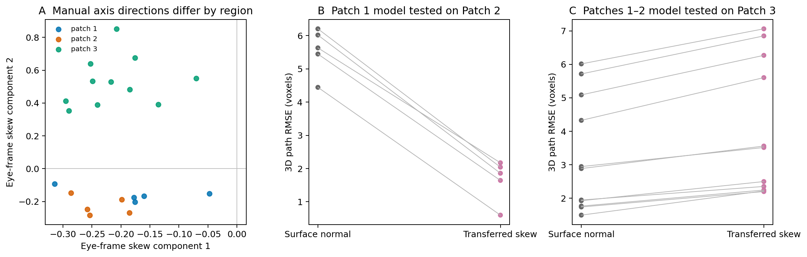

# Experiment 49: regional transfer of manually measured Pieris cone skew

## Question

Experiment 48 established that following manually traced cone centre-lines can
improve reconstruction inside one *Pieris napi* eye region. That was an oracle
diagnostic: the held-out cone's own path was available. The next question was
whether cone direction could be predicted in a new region without using that
region's paths to fit the predictor.

## Data and audit

The three annotation archives match their intended 141 × 141 × 61 unfolded
volumes by SHA-256. Patch 1 contributes five usable tracks over depths 34–50,
after the already documented cone-switch correction. Patch 2 contributes five
clean tracks over depths 30–60. Patch 3 contains 12 traces in several visible
depth bands; cone 1 has only four superficial nodes and was excluded from the
regional transfer, leaving 11 tracks with at least six nodes.

The preliminary random-forest masks were rejected. They cover 53.3%, 59.8% and
95.2% of the three patch volumes, respectively, and form implausibly large
connected components. Their high out-of-bag scores measure classification of
the sparse scribbles within the same images, not agreement with anatomical
cone labels.

## Eye-relative axis representation

Each clicked centre was mapped from its unfolded patch back to the shared 3D
scanner space using the saved corneal surface and inward-normal fields. A
straight 3D direction was fitted to each track. Its tangential displacement per
unit inward depth was then expressed in a deterministic local frame derived
from the whole corneal surface's principal axes. This makes directions from
different unfolded patches comparable without assuming that their image rows
and columns are anatomically equivalent.

The deliberately simple predictor is the median two-component skew of the
training tracks. It is anchored at the first clicked point of each test track;
the remaining test path is not used to fit the direction.

## Results

| Test | Training data | Tracks | Surface-normal path RMSE | Transferred-skew path RMSE | Straight-axis oracle RMSE | Transfer wins |
|---|---|---:|---:|---:|---:|---:|
| Patch 2 | Patch 1 | 5 | 5.63 vox | 1.86 vox | 0.43 vox | 5/5 |
| Patch 3 | Patches 1–2 | 11 | 2.89 vox | 3.52 vox | 0.46 vox | 0/11 |

Patch 1's regional skew reduces Patch 2 path error by a median 69.1%. This is a
useful replication of the tilted-axis observation, but not evidence for an
eye-wide constant correction. In the held-out Patch 3 test, the same model
increases median error by 23.3%. Patch 3's second eye-frame skew component has
the opposite sign from the first two regions.

The manual paths themselves remain informative in Patch 3. In a shallow
five-cone window, oracle-fitted straight placement reduces median normalised
intensity MAE from 0.185 to 0.114. In a deeper five-cone window, it reduces MAE
from 0.268 to 0.221. Thus the failed transfer is not evidence that Patch 3 lacks
trackable repeated structures; it shows that their directions differ
systematically from those in Patches 1–2.

Quadratic fits give modest and inconsistent gains over straight fits: no gain
in Patch 1, 6.9% lower median NMAE in Patch 2, 1.6% in the shallow Patch 3
window and 7.1% in the deep Patch 3 window. Curvature remains a secondary
candidate effect. Regional direction is the larger missing variable.

## Interpretation

The result answers the immediate model question. A surface normal is not an
adequate optical-axis proxy, but replacing it with one fixed eye-wide tilt is
also inadequate. The next model should estimate a smooth spatial orientation
field over the cornea, with small permitted curvature along individual axes.
It should be fitted on Patches 1–3 and frozen before evaluation on a fourth
region or on author-provided cone segmentations.

This conclusion is consistent with the motivation for InSegtCone: crystalline
cones can be skewed relative to the external corneal surface, and their
orientation is required for unbiased visual-axis measurements. It does not yet
establish anatomical accuracy. All current paths come from one *Pieris*
specimen and one annotator, and the clicked bright structures have not been
matched to independent volumetric cone labels.

