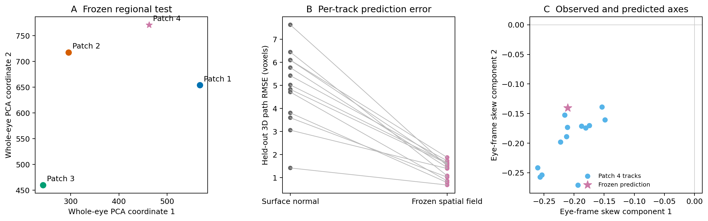

# Experiment 50: frozen fourth-region test of the Pieris orientation field

## Question

Experiment 49 showed that cone tilt is real but not constant across the eye. A
tilt learned in Patch 1 worked in Patch 2 and failed in Patch 3, where one
eye-frame component changed sign. Experiment 50 asks the next, narrower
question: can the direction in a new region be predicted from the spatial
pattern measured in Patches 1–3, without using that region's paths to choose or
tune the predictor?

## What was frozen

Patch 4 was selected from corneal surface geometry before it was annotated. Its
seed was `(234, 277, 913)` in the registered scan, the farthest unused KMeans
medoid from the first three patches. No internal direction or reconstruction
error entered that choice.

Before opening the Patch 4 annotation file, Patches 1–3 were converted into a
common whole-eye tangent frame. Their regional median skew vectors were then
combined with inverse-squared 3D distance from the Patch 4 seed. This bounded
interpolator was chosen because three training regions are too few for a stable
flexible field. It predicted Patch 4 skew `(-0.211, -0.140)`. The model, weights,
input hashes and protocol hash were written to `frozen_model.json` before Patch
4 scoring.

An affine two-coordinate field and an eye-wide constant field were retained as
secondary controls. Neither was used to change the primary result after Patch
4 was opened.

## Annotation audit

The uploaded archive matches the frozen 141 × 141 × 61 Patch 4 volume by
SHA-256. It contains 15 manual paths. Thirteen have at least six points and pass
the pre-scoring continuity rule; their largest between-node image-plane step is
at most 3.97 voxels. Cones 5 and 8 contain only four and three superficial
points and were excluded for insufficient length. No path was repaired. The
preliminary random-forest mask was not used for fitting or evaluation.

Each prediction was anchored at the first point of a manual path. Every later
point was held out from direction fitting. The primary error is therefore the
3D RMSE of those later points, rather than an in-sample line-fit error.

## Result

| Method | Median held-out path RMSE | Wins versus normal |
|---|---:|---:|
| Surface normal | 5.02 voxels (5.42 µm) | — |
| **Frozen distance-weighted field** | **1.44 voxels (1.55 µm)** | **13/13** |
| Affine spatial field | 4.86 voxels | 5/13 |
| Eye-wide constant field | 8.68 voxels | 0/13 |
| Oracle straight fit | 0.47 voxels | descriptive only |
| Oracle quadratic fit | 0.44 voxels | descriptive only |

The frozen field reduces the median error by 3.69 voxels, or 71.6%, and improves
every usable track. The exact paired sign-test value is 0.000244, although the
paths are repeated measurements from one region and should not be treated as
independent biological samples.

The quadratic oracle is slightly better than the straight oracle on all 13
tracks, but the median difference is only 0.03 voxel. Curvature is measurable
at this annotation precision; regional direction remains the much larger
effect.

## Interpretation

This is the first prospective success of the spatial-axis idea. A direction
estimated only from the three earlier regions predicts manual centre-lines in a
fourth region much better than the corneal surface normal. The result explains
an important part of the earlier Pieris registration error: the cone path is
systematically tilted, and that tilt can be locally predicted from where the
facet lies on the eye.

The boundary of the claim matters. Patch 4 is close to Patches 1 and 2 in the
eye and has a similar orientation. Training-only leave-one-region-out checks
were poor, especially for the distant Patch 3 sign reversal. The result
therefore supports local interpolation, not a solved whole-eye orientation
field. All four regions come from the same specimen and were traced by the same
person. The clicked ridges are still not independent anatomical cone
segmentations, and nothing here demonstrates fossil transfer.

The next decisive test is author-provided cone labels or a second apposition
eye. The spatial field should be frozen again and evaluated against those
independent labels. Only after that should it be used to revisit the fossil
boundary problem.
