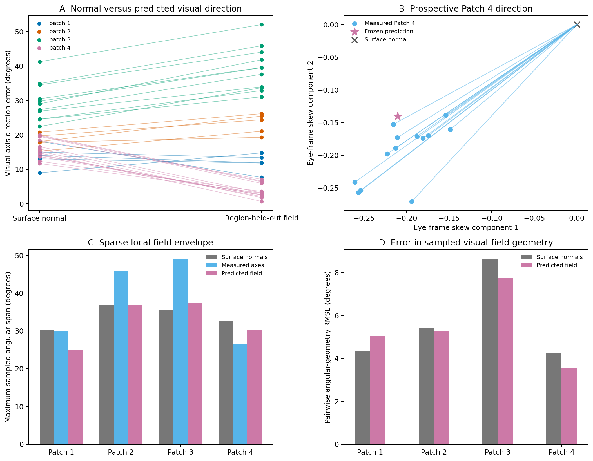

# Experiment 51: functional consequence of the measured visual axes

## Question

Does replacing the usual surface-normal assumption with the measured or
prospectively predicted internal axis materially change the inferred viewing
direction of a compound eye?

This is the functional bridge from the cone-registration experiments to the
trilobite-eye question. Eye curvature is commonly used to approximate optical
axes, but that approximation is only valid if internal optical units follow
the local surface normals closely enough.

## Frozen primary test

Experiment 50 predicted the direction of Patch 4 from the positions and median
manual directions of Patches 1–3 before the Patch 4 annotations were opened.
Experiment 51 converts the same vectors into angular errors; it does not refit
or tune the field.

Thirteen Patch 4 paths were usable. The median angular error of the local
surface normal was **15.26 degrees**. The frozen direction field reduced this
to **3.12 degrees**, improving all 13 paths. The median paired reduction was
13.23 degrees (two-sided exact sign test, p = 0.000244).

The sparse local angular geometry also improved modestly. Relative to the
manually measured axes, pairwise angular RMSE fell from 4.25 degrees for the
surface normals to 3.56 degrees for the frozen field. The observed span of the
13 traced directions was 26.44 degrees, compared with 32.74 degrees from the
surface normals and 30.29 degrees from the frozen field.

## Whole-eye diagnostic

The positive Patch 4 result is local. When each of the first three regions was
predicted only from the other regions, the direction field won for 4/5 paths
in Patch 1 but 0/5 in Patch 2 and 0/11 in Patch 3. Across all four regions, the
region-held-out field reduced the pooled median direction error from 18.28 to
14.10 degrees, but improved only 17 of 34 paths.

The simple distance-weighted field therefore does not solve the whole eye. In
particular, it misses the direction change represented by Patch 3. More dense
anatomical axes, a field model capable of representing that transition, and an
independent eye are needed before full field of view can be reconstructed.

## Interpretation

The surface-normal approximation can be biologically important: in the
prospective fourth region it misstates the manually traced local directions by
about 15 degrees. Nearby regional measurements can correct much of this error,
but the current interpolation is not transferable across the entire eye.

This is relevant to functional reconstruction of fossil eyes because it shows
that external curvature alone need not determine optical direction. It does
not establish the anatomy of the clicked *Pieris* paths, validate an *Asaphus*
internal structure, or produce a complete trilobite visual field.

## Claim limits

- The paths were traced by one annotator and are not author-provided
  crystalline-cone segmentations.
- All four regions come from one *Pieris napi* specimen.
- Local span and tangent-plane hull measurements are sparse regional
  descriptors, not the full-eye field of view.
- Nearest traced-neighbour angles are not interommatidial angles because the
  traced paths were not selected as adjacent facets.
- Patch 4 is the prospective primary result. Patches 1–3 are a secondary
  leave-one-region-out diagnostic and include important failures.

## Reproducibility

Run `experiments/manual-axis-pieris/run_functional_axis_consequence.py` with
the registered eye label, the four patch geometry directories, the four manual
annotation files and the frozen Experiment 50 JSON. The committed summary,
per-path table, regional table and figure are in
`experiments/manual-axis-pieris/results/functional_axis/`. Raw CT data and
annotation archives are excluded from Git for size and provenance reasons.
