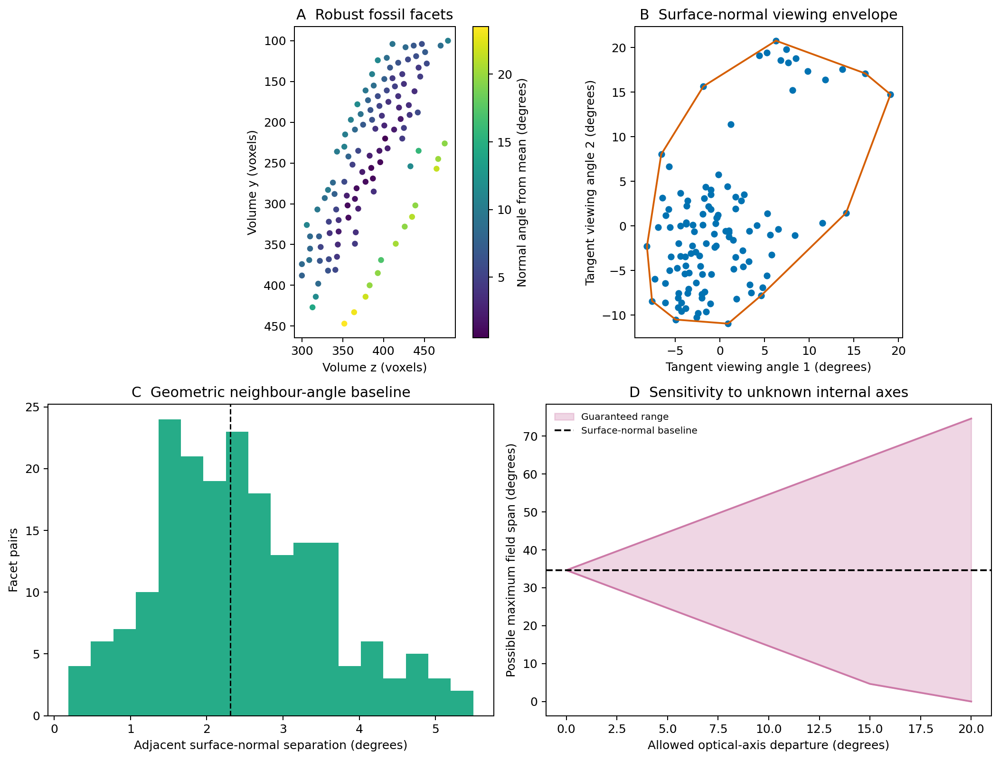

# Experiment 52: *Asaphus* geometric visual field and axis sensitivity

## Question

What does the preserved *Asaphus* facet surface imply about viewing direction,
and how much of that inference survives if the internal optical axes do not
follow the surface normals?

This experiment is the functional bridge back to the fossil. It does not use
the *Pieris* directions as an anatomical model for *Asaphus*. Instead, it
separates a reproducible surface measurement from an explicitly unknown
internal-axis departure.

## Outer-surface baseline

The frozen Experiment 36 parameters recover 116 robust facets from the 3.7 µm
*Asaphus* crop. Surface normals were calculated from the low-frequency corneal
curvature, not from the local facet relief.

The normals form a geometric angular envelope with:

- maximum sampled span: **34.64 degrees**;
- spherical convex-hull area: **0.167 steradians**;
- median separation between adjacent surface normals: **2.31 degrees**;
- median adjacent facet spacing: **64.17 µm**.

These values describe the analysed crop. They are not a full-eye field of view
or anatomically validated interommatidial angles.

## Measurement stability

Across neighbouring surface thresholds (45–70), the median change in a matched
facet normal is 0.22 degrees and the 95th percentile is 1.67 degrees. The outer
geometric measurement is therefore stable relative to intensity-threshold
choice.

This precision must not be confused with anatomical accuracy. Experiment 51
showed that internal directions in a modern *Pieris* region can depart from its
surface normals by about 15 degrees. That number is not transferred to the
fossil; it motivates asking how any chosen uncertainty bound affects the
functional conclusion.

## Assumption-free sensitivity bounds

If every unknown optical axis lies within beta degrees of its corresponding
surface normal, the triangle inequality bounds the maximum angular span within
plus or minus 2 beta of the 34.64-degree baseline.

| Allowed axis departure | Defensible maximum-span range |
| ---: | ---: |
| 5 degrees | 24.64–44.64 degrees |
| 10 degrees | 14.64–54.64 degrees |
| 15 degrees | 4.64–64.64 degrees |
| 20 degrees | 0–74.64 degrees |

The wide ranges show that the fossil scan measures the outer surface much more
precisely than it identifies the biological sight directions. External
curvature alone supports a geometric baseline, but not a precise functional
field of view.

## Interpretation

The result answers a useful part of the functional-morphology question. The
preserved facet field is sufficient to map a stable surface-normal envelope and
a geometric neighbour-angle proxy. It is not sufficient to decide the true
optical axes without anatomical evidence or a justified eye-type model.

The next decisive evidence is therefore not another threshold adjustment. It
is an independently validated relationship between corneal facets and internal
optical axes, followed by a model that is tested on an independent eye.

## Claim limits

- The analysed volume is one crop from one *Asaphus* specimen.
- Surface normals are a geometric convention, not verified optical axes.
- The crop does not cover the complete eye.
- The 0.167 sr hull is the convex envelope of sampled normals, not a biological
  field-of-view measurement.
- The uncertainty bounds do not claim that *Asaphus* has a *Pieris*-like axis
  tilt; they show how conclusions depend on any stated bound.

## Reproducibility

`experiments/asaphus/run_visual_field_sensitivity.py` reads the corrected 3.7
µm NRRD and writes the facet-normal table, threshold audit, analytic uncertainty
bounds, summary and figure. The raw CT volume is excluded from Git; its
provenance is recorded in `data/README.md`.
