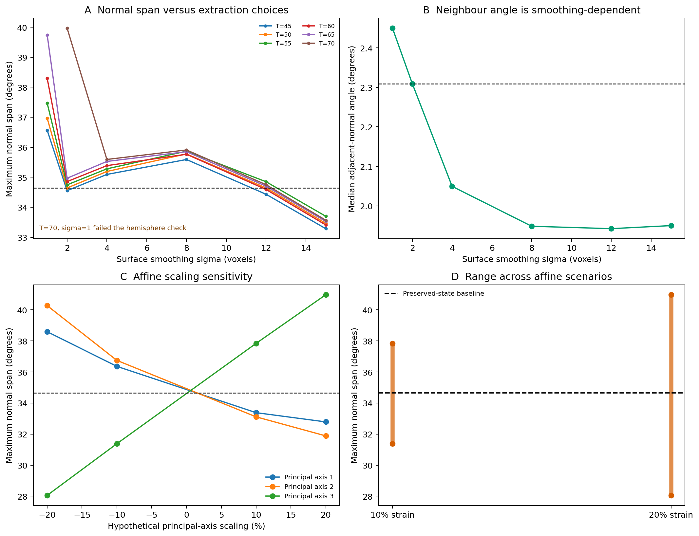

# Experiment 53: preservation-geometry audit

## Why this experiment was needed

Experiment 52 measured surface normals from the fossil in its present state.
That is reproducible geometry, but it is not automatically the geometry of the
living eye. Trilobite exoskeletons can be compressed, sheared and distorted
during burial. A small angular measurement error matters here because the
median separation between adjacent *Asaphus* surface normals is only 2.31°.

This experiment separates two questions:

1. How much do the normals change when reasonable image-processing choices are
   varied?
2. How much would they change under transparent hypothetical affine strain?

The second question is a sensitivity analysis, not a retrodeformation. The
available volume is a unilateral crop without an independent strain marker, so
the specimen's original shape is not identifiable from these data alone.

## Data and baseline

The input is the corrected 3.7 µm isotropic *Asaphus* NRRD used in Experiments
36 and 52. The same 116 robust facet centres and adjacent-facet graph were held
fixed. The preserved-state baseline has a maximum surface-normal span of
34.64°, a median adjacent-normal angle of 2.31° and a spherical hull area of
0.167 sr.

## Normal-estimation audit

The analysis varied the surface threshold from 45 to 70, surface smoothing from
1 to 15 voxels, depth-axis smoothing from 0.5 to 2 voxels and sampling position
by half a voxel in eight directions.

- At the nominal 2-voxel surface smoothing, the threshold sweep gave maximum
  spans of 34.55–39.97° and median adjacent-normal angles of 2.21–2.33°. The
  largest 95th-percentile per-facet change was 0.64°.
- At threshold 50, changing the surface smoothing gave maximum spans of
  33.46–36.97° and median adjacent-normal angles of 1.94–2.45°. The largest
  95th-percentile per-facet change was 1.67°.
- Half-voxel offsets gave maximum spans of 34.36–34.94°; their largest
  95th-percentile change from the nominal sampling was 1.06°.
- The combination threshold 70 and 1-voxel surface smoothing produced one
  non-hemispheric outlier (120.74° maximum span). It failed the geometric
  validity check and remains recorded as an unstable extraction setting rather
  than being silently removed.

This says that the nominal normal field is not merely voxel noise. It also says
that processing uncertainty is not negligible relative to a 2.31° neighbour
angle, especially when undersmoothed.

## Hypothetical affine-deformation audit

Facet positions were expressed in their principal-axis frame. The analysis then
applied ±10% and ±20% principal-axis scaling and shear. Normals were transformed
with the inverse transpose, as required for a surface under an affine transform.
These percentages are deliberately visible assumptions; they are not estimates
of geological strain.

| Scenario set | Maximum span | Median adjacent-normal angle | Largest p95 per-facet normal change |
| --- | ---: | ---: | ---: |
| Preserved baseline | 34.64° | 2.31° | — |
| 10% scaling or shear | 31.38–37.84° | 2.09–2.53° | 5.72° |
| 20% scaling or shear | 28.05–40.97° | 1.86–2.75° | 11.42° |

The deformation sensitivity is larger than the local angular spacing being
interpreted. Therefore a precise claim about the living animal's field of view,
blind regions or binocular overlap would be premature without a defensible
retrodeformation.

## What is and is not supported

The strongest supported statement is:

> The code measures the angular geometry of the *Asaphus* facet surface as
> preserved and quantifies its sensitivity to measurement choices and stated
> affine-strain scenarios.

It does **not** reconstruct the living field of view. Surface normals are not
validated optical axes, the cropped volume cannot determine specimen-specific
strain, and no ray tracing, calcite birefringence, rhabdom geometry, sensitivity
or acuity model is present. The optical objection is therefore a limit on future
interpretation, not a bug in a ray tracer: this repository currently has no
fossil ray-tracing model.

## What would permit a real retrodeformation

Useful constraints would include a complete cephalon, both eyes, independent
symmetry landmarks, sedimentological strain markers, or multiple specimens with
different deformation states. A retrodeformation model should be frozen from
those external constraints before any visual metric is examined.

## References

- Scholtz G, Staude A, Dunlop JA. [Trilobite compound eyes with crystalline
  cones and rhabdoms show mandibulate affinities](https://www.nature.com/articles/s41467-019-10459-8).
  *Nature Communications* (2019).
- Schoenemann B, Clarkson ENK; Scholtz G et al. [Exchange concerning the
  interpretation of internal structures in fossil compound eyes](https://www.nature.com/articles/s41467-021-22228-7).
  *Nature Communications* (2021).
- Jung J et al. [Virtual taphonomy of trilobite heads: understanding compressive
  deformation using 3D modeling and rigid-body simulation](https://www.cambridge.org/core/journals/journal-of-paleontology/article/virtual-taphonomy-of-trilobite-heads-understanding-compressive-deformation-using-3d-modeling-and-rigid-body-simulation/F1BE904535220BBC8134CCDD2CBEAB02).
  *Journal of Paleontology* (2024).

## Reproducibility

`experiments/asaphus/run_preservation_geometry_audit.py` writes all parameter
rows, affine scenarios, the JSON summary and the figure. The raw NRRD remains
outside Git; its provenance is recorded in `data/README.md`.
