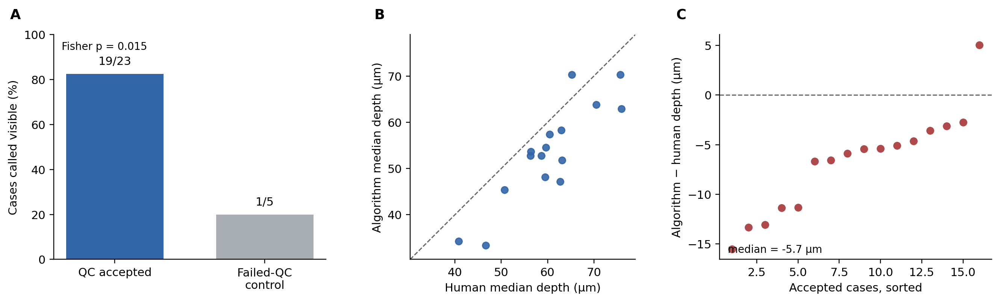

# Experiment 55 — blinded boundary pilot

## Verdict

The frozen Asaphus quality-control procedure strongly enriched for internal CT
transitions that one blinded observer could recognise. Human clicks and the
edge extractor referred to broadly the same depth region, but the observer
placed the transition systematically deeper. This is an internal pilot, not
independent anatomical validation.

## What was tested

Thirty randomized local CT patches contained 25 facets accepted by the frozen
edge quality controls and five failed-QC controls. The observer could not see
the original facet identity, group, spatial block, or algorithm-derived depth.
After the annotation file was frozen, the private key was used for analysis.

Twenty-eight cases were reviewed. The observer called 20 visible, seven
uncertain and one not visible. Seventeen cases had points in both orthogonal
depth sections, giving 53 clicks. All confidence values remained at the
default 1/5, so confidence was not used as a quantitative weight.

## Result

- accepted facets called visible: **19/23**
- failed-QC controls called visible: **1/5**
- visibility odds ratio: **19.0**
- two-sided Fisher exact p: **0.0148**
- accepted cases with human–algorithm comparison: **16**
- median per-case pointwise absolute difference: **6.01 µm**
- p90 per-case pointwise absolute difference: **9.95 µm**
- median absolute disagreement between the two human views: **1.86 µm**

The depth disagreement was not centred on zero. In 15 of 16 accepted cases,
the algorithm marked a shallower transition than the observer. The median
algorithm-minus-human offset was **−5.66 µm**; the two-sided sign-test p-value
was **0.00052**.

## Interpretation

The visibility result supports the QC procedure: accepted maps were much more
likely than failed controls to contain a recognisable internal transition. The
small U-versus-V disagreement shows that the observer usually selected a
similar depth in two perpendicular sections.

The systematic offset prevents the human clicks from being treated as direct
ground truth for the extractor. The likely explanation is definitional: a
gradient operator selects the onset or steepest part of a broad transition,
whereas a person tends to click its visually clearer centre or deeper margin.
Future annotation must show examples that define these alternatives without
revealing the algorithm prediction.

The result does not identify the transition. It remains compatible with a
proximal cuticular boundary, a cone-associated structure, or a
mineral-replacement/dissolution front. The observer developed the project and
knew its approximate depth range; consequently this is evidence for internal
repeatability, not an independent expert confirmation.

## Next use

The existing labels are frozen and will not be edited after unblinding. They
will be used to redesign the task and estimate its ambiguity. A new randomized
pack should be reviewed by at least one specialist familiar with fossil
arthropod eye anatomy and, separately, one specialist in fossil synchrotron or
micro-CT interpretation.
