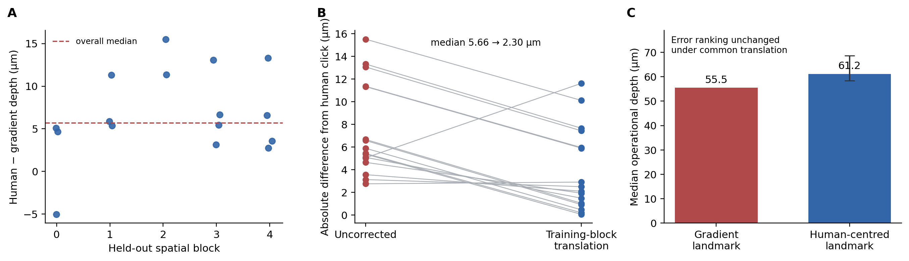

# Experiment 56 — boundary-definition sensitivity

## Verdict

The blinded observer and the frozen gradient extractor usually marked different
positions within the same broad CT transition. A spatially held-out translation
can reconcile much of that operational difference. It changes the reported
absolute depth, but a common translation cannot change the Experiment 54
reconstruction errors or model ranking.

This resolves a measurement-definition problem. It does not identify the
transition anatomically.

## What was tested

Experiment 55 supplied 16 accepted facets with human clicks and algorithm
depths across all five spatial blocks. For each held-out block, the median
human-minus-gradient offset was estimated using only cases in the other four
blocks. That translation was then applied to the held-out algorithm depths.

A separate numerical audit translated every target and every corresponding
prediction from all nine Experiment 54 methods by the same physical distance.
For a prediction \(p\), target \(t\) and definition shift \(\delta\),

\[
|(p + \delta) - (t + \delta)| = |p - t|.
\]

The numerical implementation confirmed this equality to floating-point
precision across the complete Experiment 54 prediction table.

## Results

- cases with a depth comparison: **16**, spanning **5** spatial blocks
- median human-minus-gradient shift: **5.66 µm**
- median absolute deviation of that shift: **2.32 µm**
- empirical 10th–90th percentile shift: **2.94–13.20 µm**
- uncorrected median case-level disagreement: **5.66 µm**
- spatially held-out corrected median disagreement: **2.30 µm**
- corrected 90th-percentile disagreement: **8.89 µm**
- cases improved by the held-out translation: **14/16**

The gradient-defined median target depth in Experiment 54 was **55.50 µm**.
Applying the observer-centred median definition moves it to **61.16 µm**. The
empirical 10th–90th percentile translations correspond to **58.44–68.70 µm**.
That range describes operational landmark ambiguity in this small internal
pilot; it is not a confidence interval for lens thickness.

## What remains unchanged

When target and reconstruction use the same translated definition, the maximum
numerical change in pointwise absolute error across nine methods was
**2.84 × 10⁻¹⁴ µm**. The six-neighbour method therefore remains at **8.10 µm**
median facet MAE and **12.00 µm** p90 facet MAE. The conclusion that neighbouring
preserved homologues outperform outer curvature alone is not an artefact of a
uniform 5.66 µm boundary offset.

## What does change

The inferred absolute depth changes, and the shift is not identical in every
facet. After calibration, the p90 disagreement remains 8.89 µm. Experiment 54's
prediction intervals quantify reconstruction error relative to the gradient
landmark; they do not include this separate boundary-definition ambiguity.

With only 16 cases from one informed observer, the current data cannot test a
complex spatially varying correction. Such a correction could affect local
surface shape or model ranking, so that possibility remains unresolved rather
than assumed absent.

## Scientific boundary

Experiment 56 supports two narrow statements:

1. the gradient and observer usually refer to the same broad transition but
   choose different operational positions within it; and
2. the main Experiment 54 comparison is invariant to a common definition
   shift.

It does not show that either landmark is the proximal lens surface, a
crystalline cone boundary or a biological optical interface. Independent
annotations must define the intended landmark with examples, and fossil-eye
and CT-preservation specialists must assess its anatomical identity.
