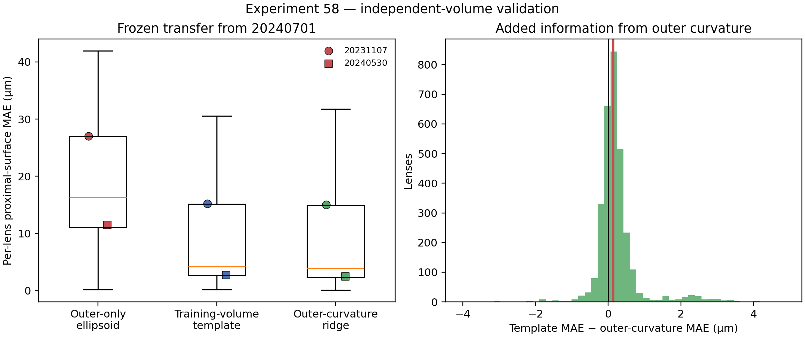

# Experiment 58 — Arthur Zhao cross-volume validation

## Verdict

The supplied modern-eye meshes answer the project's central method question
more directly than the fossil candidate boundary could. A distal-surface
ellipsoid does **not** recover the hidden proximal lens surface. A learned
population template can be accurate on a similar independent volume, but it
does not survive a large between-volume depth shift. Local outer curvature
adds a small, consistent improvement to that template; it does not make the
outer-only reconstruction reliable by itself.

## Why this experiment was run

Lauren Sumner-Rooney identified the biologically important failure mode: fossil
lenses often preserve the outer curvature while losing the internal/proximal
surface. Arthur Zhao then supplied complete *Drosophila* lens and
photoreceptor-tip meshes for three micro-CT volumes. These meshes provide a
verified modern lens target, independent of the unresolved anatomical identity
of the *Asaphus* CT boundary.

The public [`reiserlab/eyemap_T4`](https://github.com/reiserlab/eyemap_T4)
repository contains processed landmark data for the same volumes. Its RData
files retain the original PCA scores, rotation and centre. Inverting that
transform recovers the raw mesh-coordinate landmarks; on 20240701, the
reconstruction matches the public raw CSV coordinates to machine precision.

## Frozen protocol

Experiment 57 was developed on 20240701. Experiment 58 then froze that method,
trained only on 20240701 and scored 20231107 and 20240530 without refitting on
either test volume.

The first audit exposed an invalid 30 µm target-depth ceiling inherited from
the development volume. It rejected 729 otherwise supported 20231107 lenses
precisely because that scan has deeper lenses. Target magnitude is not a data-
quality variable, so the ceiling was removed and every volume was rerun. The
predictors and training data were unchanged. The final result is therefore a
frozen-model external validation, not a preregistered confirmatory test.

The complete lens layer is a connected surface rather than a set of labelled
individual lenses. Target construction therefore uses the annotated lens
positions to partition the layer into nearest-landmark patches and the matched
tip direction to label each patch's distal and proximal layers. This use of
complete geometry is confined to masking and ground-truth construction.

After masking, all complete-lens centroids, tip coordinates and proximal
vertices are discarded. The prediction origin, normal, tangent frame, scale,
quadratic cap coefficients and operational eye centre are re-estimated from
the retained distal surface only. The tip mesh is used for alignment/provenance
checks, not as a prediction feature.

The proximal target and each prediction are compared on the same central
canonical disk. The reported score is the median, across lenses, of each
lens's mean absolute surface error.

Three fixed methods are compared:

1. **axisymmetric ellipsoid:** fit lateral radius and distal sag to the visible
   cap and continue the fitted ellipsoid to its hidden branch;
2. **training-volume template:** subtract the median 20240701 thickness surface
   from the observed test cap;
3. **outer-curvature ridge:** learn a 20240701 mapping from visible cap scale
   and quadratic shape to the thickness surface.

## Data and QC

| Volume | Role | Annotated lenses | Patches passing frozen QC |
|---|---|---:|---:|
| 20240701 | training | 1,709 | 1,679 |
| 20240530 | untouched test | 1,611 | 1,575 |
| 20231107 | untouched test | 1,632 | 1,508 |

The 2023 mesh is substantially more coarsely tessellated. Its median
lens-landmark-to-mesh distance is 12.13 µm, compared with 7.90 µm for 20240530
and 6.39 µm for 20240701. Nevertheless, 92.4% of its annotated lenses pass the
corrected support, orientation and surface-fit criteria.

## Results

| Held-out volume | Median target depth | Ellipsoid MAE | 20240701 template MAE | Outer-curvature ridge MAE |
|---|---:|---:|---:|---:|
| 20240530 | 16.35 µm | 11.53 µm (72.8%) | 2.72 µm (16.5%) | 2.49 µm (15.4%) |
| 20231107 | 28.97 µm | 27.04 µm (97.4%) | 15.23 µm (52.6%) | 15.03 µm (51.9%) |

Percentages are median per-lens MAE divided by median target depth. The
20240530 result shows that a population thickness prior can transfer across a
similar modern scan. The 20231107 result shows the limit: its proximal surface
is much deeper than in the training volume, and neither the fixed template nor
the outer-curvature model recovers that shift.

Relative to the training-volume template, the outer-curvature ridge has a
median paired advantage of:

- **0.084 µm** on 20240530 (bootstrap interval 0.075–0.094 µm; wins 1,004/1,575
  lenses);
- **0.225 µm** on 20231107 (0.210–0.237 µm; wins 1,146/1,508);
- **0.139 µm** pooled descriptively across both tests (0.129–0.151 µm).

Those bootstrap intervals resample lenses and therefore measure facet-level
stability, not biological replication. There are only two independent test
volumes, and the pooled number must not be described as 3,083 independent
animals or scans.

## Interpretation against the project goal

This experiment brings the work closer to Lauren's stated goal, rather than
away from it. It directly hides a verified proximal lens surface while
retaining the distal surface. It also changes the wording of the answer:

- a geometrically continued ellipsoid is not enough;
- a learned population prior can be useful when the test eye lies close to the
  training morphology;
- measured outer curvature contains some transferable information, but the
  added value is small compared with between-volume depth variation;
- domain-shift detection and calibrated uncertainty are required before the
  method can be applied defensibly to a fossil.

The result validates a computational benchmark on modern lens anatomy. It does
not identify the *Asaphus* candidate CT boundary, validate the fossil target,
or show that a Drosophila prior transfers to a trilobite.

## Provenance and redistribution

The supplied WRL meshes are not committed or redistributed. Aggregate outputs
record SHA-256 hashes for the exact six mesh files and three public RData files
used. Arthur Zhao and Michael Reiser are credited in the repository
acknowledgements; acknowledgement does not imply endorsement.
