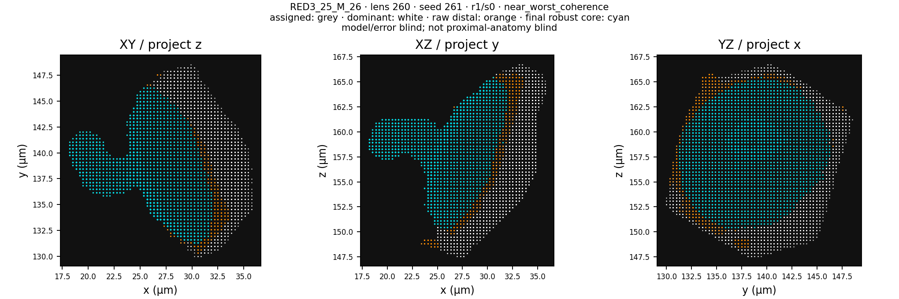
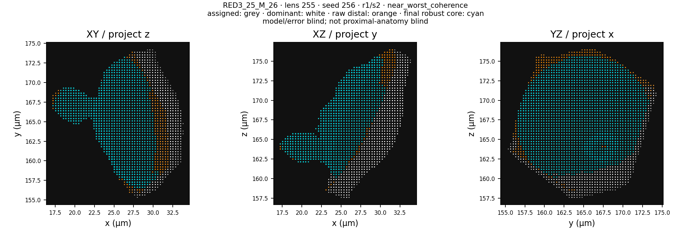

# Experiment 64 — robust-cap pre-outcome visual-QC stop

## Verdict

**Experiment 64 stopped before attestation and model-outcome evaluation.** At
frozen commit `7ad346c8bde08c81d49e9c417441d825719c6de8`, the predetermined
disjoint visual sample contained a robust distal core with a large connected
lateral lobe. A second AI visual assessment returned the same nonpass
classification under the frozen criterion. This was not an independent human
or anatomical-expert review. The frozen no-replacement rule therefore forbids
passing attestations, opening the separately sealed outcomes, and executing the
shape-versus-control backend.

No target artifact was opened; no prediction, error, score or model comparison
was computed or inspected. Experiment 64 has no result on whether the four
distal shape descriptors outperform the nested position-and-scale control. Its
result is technical: at least one automatically eligible sampled core violated
the prespecified visual-coherence criterion, so the automatic gates did not
guarantee that criterion and Experiment 64 was ineligible for scoring.

## What completed before the stop

The implementation and protocol were frozen before the new visual sample was
drawn. All tests passed with warnings treated as errors: 230 in the Maike
workflow, 6 in the Arthur workflow, 2 in the boundary-sensitivity workflow and
1 in the annotator. Experiment 63's implementation remained untouched.

All six Arthur eye paths and all twelve cleaned Maike stacks were then rebuilt
at the frozen commit. The visual review and stop decision consumed only
target-free technical documents and visual artifacts.

| Cohort | Fixed rows | Robust-core pass | Automatic distal-QC pass |
|---|---:|---:|---:|
| Arthur, three animals / six nested eyes | 4,942 | 4,934 | 4,904 |
| Maike, twelve animals / one eye each | 11,369 | 11,369 | 11,343 |

For Maike, 11,349 lenses passed the base distal-QC rules; the final
voxel-connectivity and residual-tail gates removed six more. These are
technical predictor counts, not target-resolvability or model-outcome counts.

The renderer then created exactly 32 cases per eye under the frozen 4 × 4
radial-position-by-robust-scale design. All 384 identities were disjoint from
the 384 Experiment 63 development identities, and every sample manifest
attested that no forbidden outcome artifact had been opened.

## Decisive visual failure

`RED3_25_M_26` sample ordinal 8 (lens 260, seed 261) was selected as the
near-worst-coherence case in radial stratum 1 and scale stratum 0. In both XY
and XZ projection, the cyan final robust core retains a large lateral lobe
joined to the putative central cap by a narrow neck. This directly violates
the frozen requirement that the final core be one coherent central cap without
a residual shelf, prong or satellite.

The render SHA-256 is
`61d88111cc60c34b90f2ea9aaf06157aa6adcc8a686e9bf013d43bad611c0669`.
The bound sample-manifest SHA-256 is
`e15ec2733b903068bc2c5dd9977353c6b2d7e3220d1d34c37f9856e00fd4c22d`.

A second already-rendered case in the same eye, sample ordinal 12 (lens 255),
showed the same connected-lobe pattern and also received two concordant AI
nonpass assessments. It corroborates the technical diagnosis but was not
needed for the stop decision.

## Concurrent-review disclosure

Eye samples were assessed concurrently. Before the global stop propagated,
first-pass AI assessments had flagged 41 cases as nonpassing and 6 as
indeterminate. Those additional flags were not all second-reviewed and
adjudicated, so they are unadjudicated workflow telemetry and are not used to
estimate a lens- or eye-level failure rate. The experiment's decision needs
only one nonpass; the decisive case and the corroborating case above each
received two concordant AI visual assessments.

Because all twelve samples were rendered and review proceeded concurrently,
all 384 Experiment 64 identities are conservatively treated as viewed
development cases. Their exact lens/seed identities, strata, roles, render
paths and render hashes are preserved in
[`experiment_64_visual_exposures.json`](../experiments/maike-modern-ground-truth/results/experiment_64_visual_exposures.json).
This prevents a later experiment from presenting any of them as unseen.

## What this resolves

Experiment 64 tested the proposed repair to Experiment 63 rather than merely
trying another predictive model. The answer is negative and useful:

> The frozen geometric-median/q90 robust core plus 26-connectivity and
> residual-tail gates failed the prespecified visual-coherence gate: at least
> one automatically eligible sampled core violated that criterion, making
> Experiment 64 ineligible for scoring.

The failed appendage is connected to the main cap, so a largest-component
connectivity rule cannot remove it. The case also survived the residual-tail
gate. This shows that passing the current automatic metrics does not guarantee
compliance with the prespecified visual-coherence criterion.

Notably, `RED3_25_M_26` passed all 32 cases in Experiment 63's different
sample. The new disjoint sample found a failure not represented in that eye's
Experiment 63 sample.

## What remains unresolved

- There is still no twelve-animal result comparing distal shape descriptors
  with the nested position-and-scale control.
- Nothing here says whether distal shape would or would not help if a producer
  passed a prospectively frozen technical gate.
- This does not identify the candidate fossil boundary, reconstruct a fossil
  lens, validate an optical axis, or recover fossil visual performance.
- The visual assessments were performed by AI agents, not by an independent
  human or anatomical expert.

## Consequence for any next experiment

Experiment 64 must not be rerun, redrawn or rescued by changing thresholds.
A later revision requires a new experiment number and must treat all 768
Experiment 63 and 64 sample identities as development cases. A credible next
producer must detect attached lobes through local surface continuity or
shape/topology reasoning rather than connected-component size alone, and it
must again pass a prospectively frozen disjoint visual gate before outcomes
are opened.

Because these same twelve animals have now informed two rounds of technical
development, newly supplied animals are the cleanest route to an untouched
confirmation of any later producer.

The immutable machine-readable decision is in
[`experiment_64_stop_record.json`](../experiments/maike-modern-ground-truth/results/experiment_64_stop_record.json).
